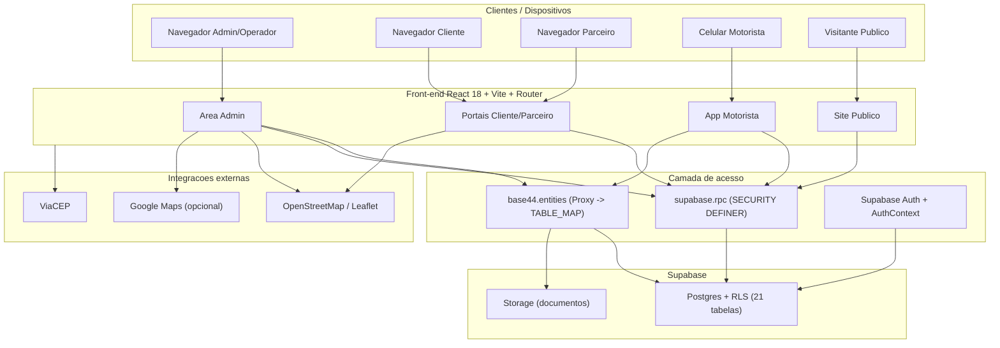
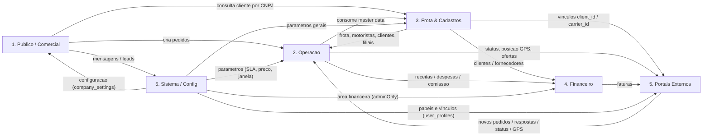
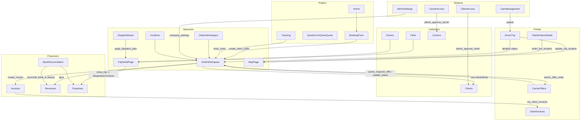

# 🏛️ Arquitetura Funcional — Velox TMS

> Documento de **arquitetura funcional existente**, derivado exclusivamente do
> `INVENTARIO-SISTEMA.md`. Apenas documenta a estrutura atual — não contém
> sugestões, críticas nem propostas de melhoria.
>
> Gerado em 2026-06-30 (skills aplicadas em modo documentação: `ux-flow`,
> `ui-review`, `ui-ux-designer`, `redesign-existing-projects`).

---

## Modelo de domínios (visão macro)
O sistema organiza-se em **6 domínios funcionais** sobre uma **camada de dados
única** (Supabase/Postgres via `base44` + RPCs `SECURITY DEFINER`), com
identidade/permissão centralizada em `user_profiles` e parâmetros em
`company_settings`.

| # | Domínio | Usuários | Natureza |
|---|---|---|---|
| 1 | Site Público / Comercial | visitante anônimo | entrada de demanda |
| 2 | Operação | admin, operator, motorista | execução logística |
| 3 | Frota & Cadastros (Master Data) | admin, operator | dados-mestre |
| 4 | Financeiro | admin | gestão financeira |
| 5 | Portais Externos | client, carrier, motorista | autoatendimento |
| 6 | Sistema / Configuração | admin | governança |

---

## 1. Domínio — Site Público / Comercial
- **Objetivo:** captar demanda e dar o ponto de entrada externo (institucional, agendamento, cotação, rastreamento).
- **Responsabilidades:** apresentar a empresa, receber agendamentos públicos, gerar cotações, permitir rastreamento por protocolo e registrar contatos.
- **Módulos:** Home, BookingForm (`/agendar`), QuoteForm (`/cotacao`), QuickQuote (`/cotacao-avancada`), Tracking (`/rastrear`), componentes `public/*` (Hero, Services, Contact, Footer…).
- **Principais funcionalidades:** cálculo de frete (`freightCalculator`), verificação de cobertura (`coverageChecker`), criação de pedido (`create_client_order`/anônimo), rastreamento (`track_order`), envio de contato (`contact_messages`).
- **Usuários responsáveis:** visitante público (anônimo).
- **Dependências:** Operação (cria pedidos), Frota & Cadastros (`client_by_cnpj`), Sistema/Config (`public_settings`, cobertura, preço), ViaCEP.
- **Comunicação:** injeta pedidos na **Operação** e mensagens no **Sistema**; lê configuração pública.
- **Entradas:** CEP, carga, NF, dados de contato. **Saídas:** pedido com protocolo, lead/mensagem, cotação.

## 2. Domínio — Operação
- **Objetivo:** executar o ciclo logístico do pedido até a entrega.
- **Responsabilidades:** pedidos/coletas, despacho, viagens, transferências, ocorrências, replanejamento, rastreamento ao vivo.
- **Módulos:** OperationsHub, OrdersWorkspace/OrderWorkspace/NewOrder/Cotacao, DispatchBoard, Replanning, Incidents, Transfers, Trips/NewTrip/TripDetailPage, MapPage; utils `dispatchPlanner`, `routePlanner`, `routeOptimizer`, `loadPacker`, `incidentSla`, `replanner`, `waitingTime`, `staleOrders`.
- **Principais funcionalidades:** aprovação e stepper de status, despacho DnD, roteirização, comboio multi-veículo, backhaul, estadia, encerramento atômico (`close_trip`), ocorrências kanban+SLA, transferências entre filiais, GPS (`update_trip_location`).
- **Usuários responsáveis:** admin, operator (gestão); motorista (execução/GPS/status).
- **Dependências:** Frota & Cadastros (recursos), Financeiro (gera receitas/despesas), Sistema/Config (SLA, janelas).
- **Comunicação:** recebe pedidos do **Público** e dos **Portais**; emite receitas/despesas ao **Financeiro**; alimenta os **Portais** (status, posição); consome master data de **Cadastros**.
- **Entradas:** pedidos, recursos (frota/motoristas). **Saídas:** status/entregas, receitas/despesas, posições GPS, documentos (romaneio, etiquetas, comprovante).

## 3. Domínio — Frota & Cadastros (Master Data)
- **Objetivo:** manter os dados-mestre e recursos operacionais.
- **Responsabilidades:** clientes, destinatários, fornecedores, filiais, transportadoras parceiras, frota, motoristas, documentos.
- **Módulos:** CadastrosPage (Clients/Recipients/Suppliers/Branches), ClientDetailPage, FrotaPage (Fleet/Drivers/LoadingSimulator), Truck/DriverDetailPage, Carriers, Documents.
- **Principais funcionalidades:** CRUD de master data, tabela de frete por cliente, contatos, simulador 3D de carregamento (Truck3D), documentos da empresa (Storage).
- **Usuários responsáveis:** admin, operator.
- **Dependências:** Sistema/Config (parâmetros), Supabase Storage (documentos).
- **Comunicação:** provê entidades para **Operação** (frota/motoristas/clientes/destinatários/filiais), **Financeiro** (clientes/fornecedores) e **Portais** (vínculos `client_id`/`carrier_id`).
- **Entradas:** cadastros. **Saídas:** entidades-mestre consumidas por todos os domínios.

## 4. Domínio — Financeiro
- **Objetivo:** gestão financeira (faturamento, contas, resultado, conciliação).
- **Responsabilidades:** faturas, receitas, despesas, DRE, fluxo de caixa, conciliação bancária.
- **Módulos:** FinanceiroPage (Financial/Invoices/Revenues/Expenses/DRE/CashFlow/BankReconciliation); utils `revenueHelper`, `reconcileMatch`, `parseBankStatement`.
- **Principais funcionalidades:** faturamento mensal (`create_invoice`/`pay_invoice`), receitas/despesas, DRE, fluxo de caixa, importação OFX/CSV + baixa (`reconcile_bank_tx`/`unreconcile_bank_tx`).
- **Usuários responsáveis:** admin (área `adminOnly`).
- **Dependências:** Operação (origem de receitas/despesas), Frota & Cadastros (clientes/fornecedores), banco externo (extrato).
- **Comunicação:** consome eventos da **Operação** (encerramento de viagem → despesas/comissão; pedidos → receitas); emite faturas para o **Portal do Cliente**.
- **Entradas:** receitas/despesas da operação, extrato bancário (OFX/CSV). **Saídas:** faturas (PDF), baixas no ledger, DRE/fluxo, indicadores financeiros.

## 5. Domínio — Portais Externos
- **Objetivo:** autoatendimento de clientes, transportadoras parceiras e motoristas.
- **Responsabilidades:** Portal Cliente (pedidos/faturas/rastreio), Portal Transportadora (ofertas/cargas/status), App Motorista (viagem/checklist/GPS).
- **Módulos:** PortalLayout + ClientOrders/ClientNewOrder/ClientOrderDetail/ClientInvoices; CarrierLayout + CarrierOffers/CarrierOrders/CarrierOrderDetail; DriverHome/DriverTrip/DriverHistory.
- **Principais funcionalidades:** criar pedido e ver faturas/rastreio (cliente); aceitar/recusar oferta e atualizar status (parceiro); executar viagem, exceções e GPS (motorista).
- **Usuários responsáveis:** client, carrier, motorista.
- **Dependências:** Operação (pedidos/viagens/status), Financeiro (faturas), Frota & Cadastros (vínculos), Sistema (aprovação de acesso).
- **Comunicação:** via RPCs com escopo (`my_client_*`, `my_carrier_*`, `order_live_location`, `carrier_respond_offer`, `carrier_update_order_status`, `update_trip_location`); dependem da **aprovação** do Sistema.
- **Entradas:** novos pedidos, respostas de oferta, atualização de status, posição GPS. **Saídas:** mudanças de status na Operação, pedidos novos, posições.

## 6. Domínio — Sistema (Administração & Configuração)
- **Objetivo:** governar a plataforma — identidade, permissões, parâmetros e observabilidade.
- **Responsabilidades:** usuários/roles, aprovação de acessos (cliente/parceiro), configurações (empresa/cobertura/preço/alertas/agenda/rotas/site), indicadores, mensagens, alertas.
- **Módulos:** UserManagement, ClientAccess, CarrierAccess, ConfigPage/AdminSettings, Indicators, Messages, AlertsPage.
- **Principais funcionalidades:** criar/role/ativar/reset/excluir usuário (`admin_*`), aprovar cliente/parceiro (`admin_approve_client`/`admin_approve_carrier`), parametrizar (`company_settings`), KPIs, mensagens, alertas.
- **Usuários responsáveis:** admin.
- **Dependências:** todos os domínios (parametriza e governa).
- **Comunicação:** fornece configuração a todos (`public_settings`/`company_settings`), governa identidade/permissão (`user_profiles`) e aprova vínculos dos **Portais**.
- **Entradas:** configurações e solicitações de acesso. **Saídas:** parâmetros, papéis/vínculos, indicadores.

---

## Como os domínios se comunicam
A comunicação **não é por chamadas diretas entre telas**, e sim **mediada pela
camada de dados**:
1. **Tabelas compartilhadas** (via `base44`/Supabase): `orders`, `trips`, `revenues`, `expenses`, `invoices` etc. são o ponto de encontro entre domínios.
2. **RPCs `SECURITY DEFINER`** com escopo por papel: encapsulam transações e isolam os Portais (`my_client_*`, `my_carrier_*`).
3. **RLS + `user_profiles`**: o Sistema define papel/vínculo; os demais domínios respeitam o escopo.
4. **Configuração compartilhada** (`company_settings`/`public_settings`): o Sistema parametriza Público, Operação e Financeiro.
5. **Eventos lógicos** (encadeamento por estado): encerrar viagem → cria despesas/receitas; pedido entregue → faturável; oferta aceita → status reflete em Operação e Portal Cliente.

---

## Dependências entre módulos (resumo)
| Módulo origem | Depende de / aciona | Mecanismo |
|---|---|---|
| BookingForm / Tracking | OrderWorkspace | `create_client_order` / `track_order` |
| OrderWorkspace | Clients, Invoices, Revenues | master data, `create_invoice` |
| DispatchBoard | TripDetailPage | `apply_dispatch_plan` |
| TripDetailPage | Expenses, Revenues, Fleet, Drivers | `close_trip` (comissão/custos) |
| OrderWorkspace | CarrierOffers | `admin_offer_order` |
| CarrierOffers/Detail | OrderWorkspace | `carrier_respond_offer` / `carrier_update_order_status` |
| DriverTrip | MapPage, OrderWorkspace | `update_trip_location`, status |
| ClientOrderDetail | MapPage | `order_live_location` |
| BankReconciliation | Revenues, Expenses | `reconcile_bank_tx` (baixa) |
| ClientAccess / CarrierAccess | Clients / Carriers | `admin_approve_client` / `admin_approve_carrier` |
| AdminSettings | todos | `company_settings` |

---

## Diagrama 1 — Arquitetura geral (camadas)

## Diagrama 2 — Comunicação entre domínios

## Diagrama 3 — Relacionamento entre módulos

---

## Entradas e saídas por domínio (resumo)
| Domínio | Entradas | Saídas |
|---|---|---|
| 1. Público | CEP, carga, NF, contato | pedido (protocolo), lead/mensagem, cotação |
| 2. Operação | pedidos, recursos (frota/motoristas) | status/entregas, receitas/despesas, GPS, documentos |
| 3. Cadastros | cadastros (master data) | entidades-mestre para todos |
| 4. Financeiro | receitas/despesas da operação, extrato OFX/CSV | faturas (PDF), baixas, DRE/fluxo, KPIs |
| 5. Portais | pedidos, respostas de oferta, status, GPS | mudanças de status, novos pedidos, posições |
| 6. Sistema | configurações, solicitações de acesso | parâmetros, papéis/vínculos, indicadores |
