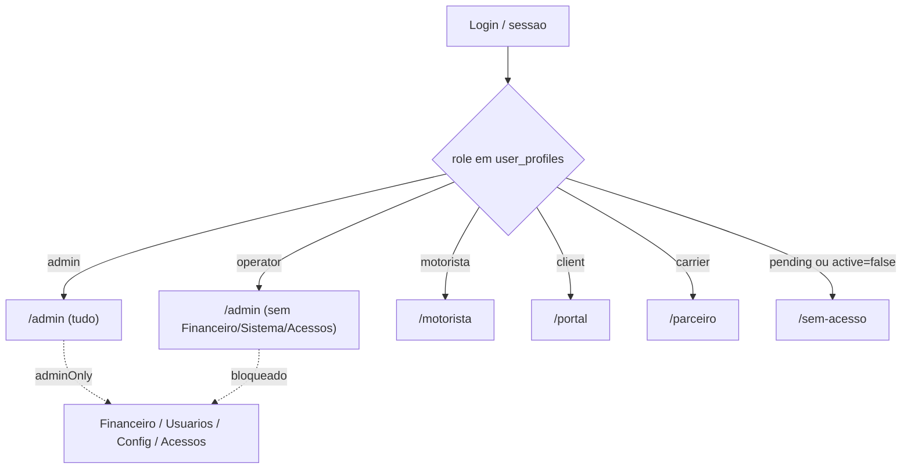
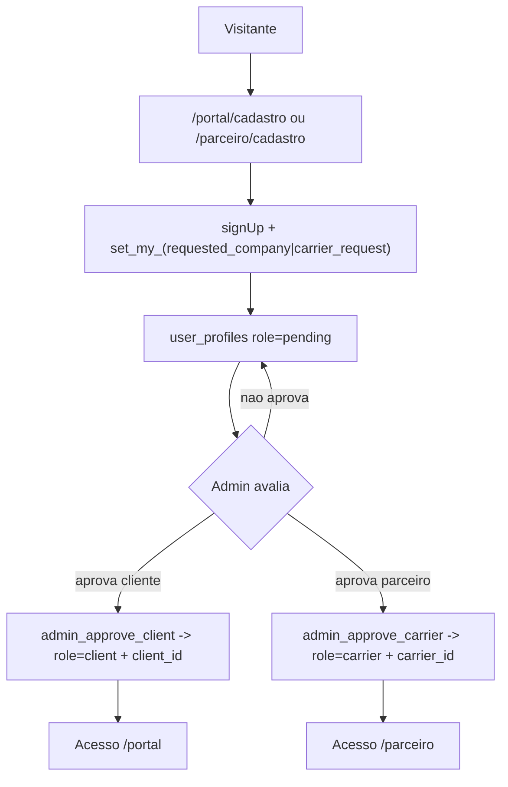
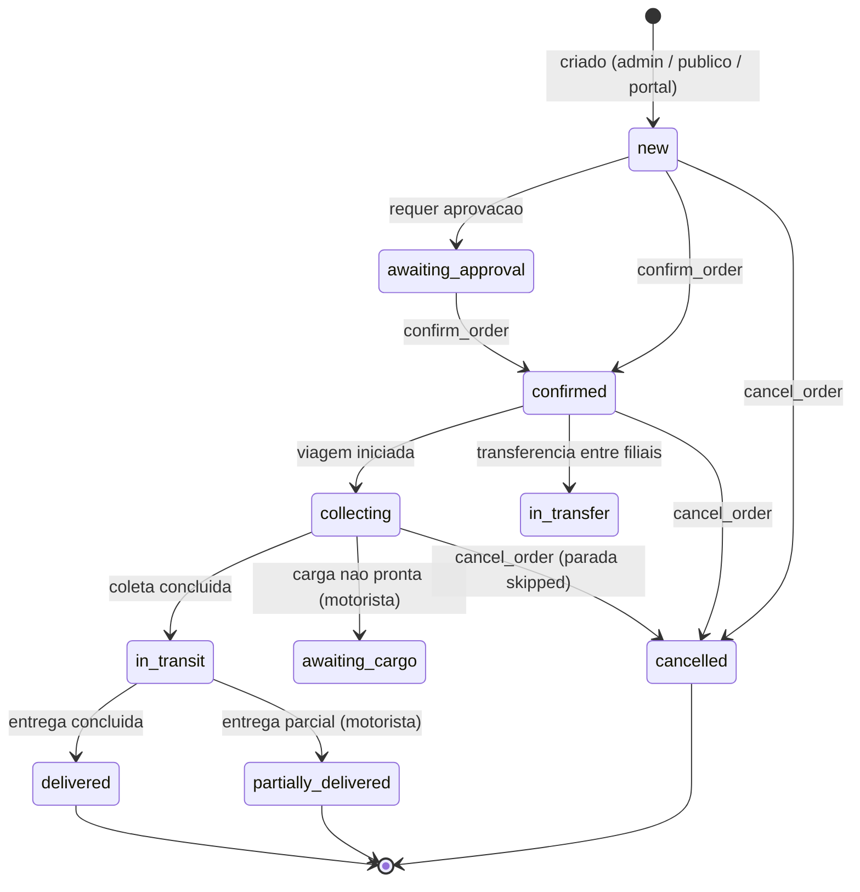
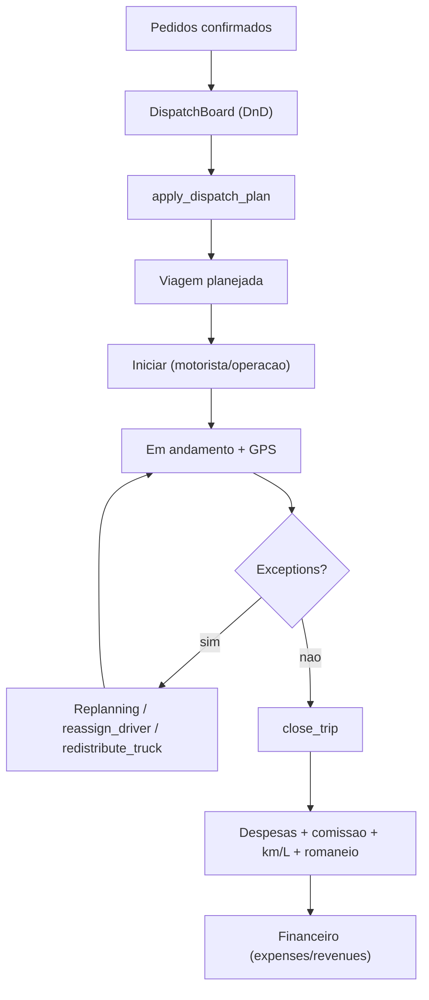
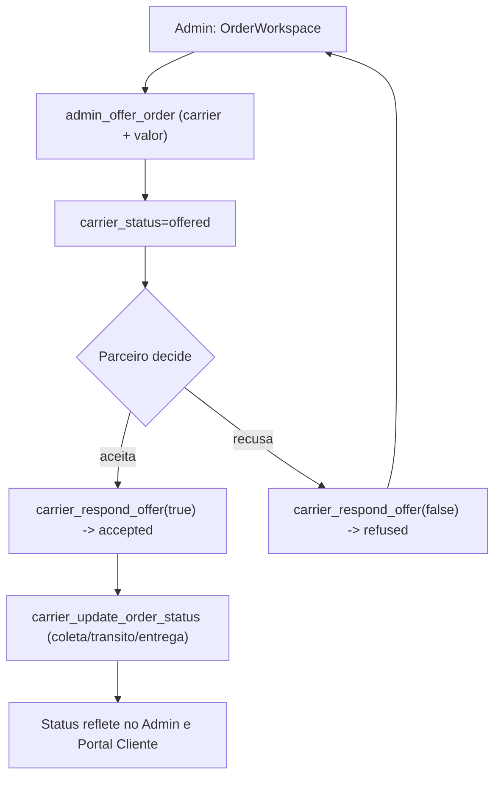
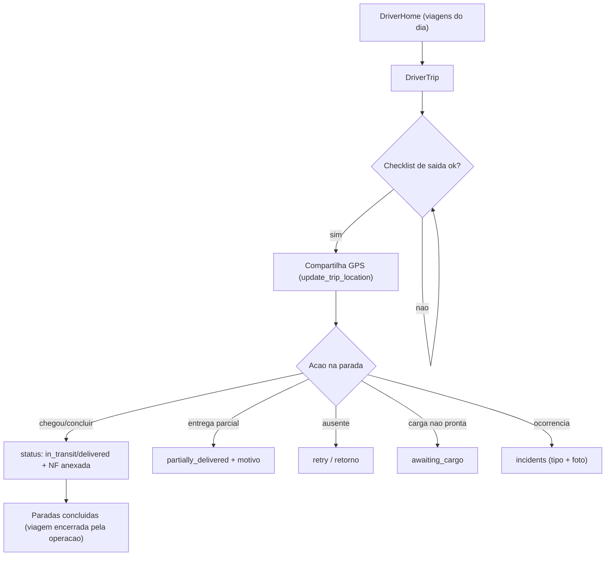
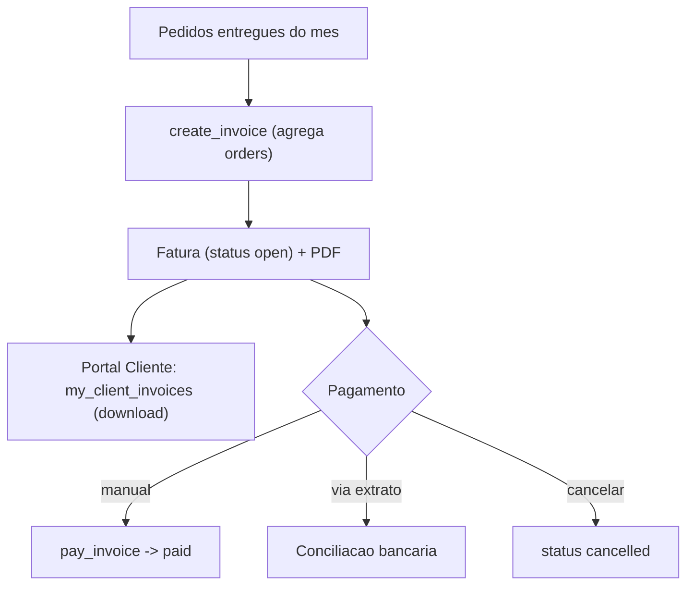
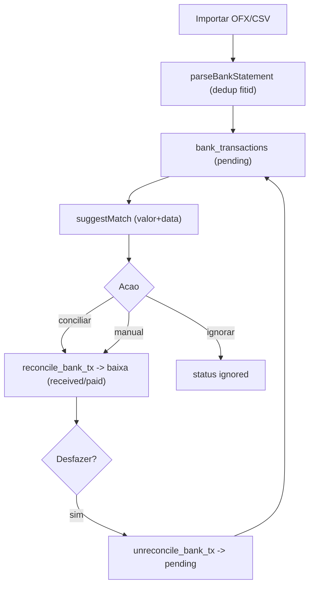
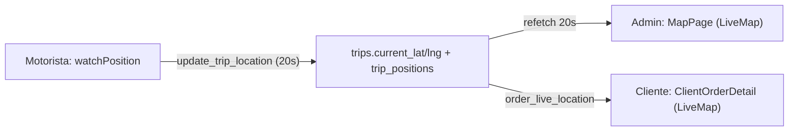

# 🧭 Mapa de Fluxos & Perfis — Velox TMS

> Documento de **mapeamento de perfis, permissões e fluxos existentes**, derivado
> do `INVENTARIO-SISTEMA.md` e da `ARQUITETURA-FUNCIONAL.md`, com confirmação
> pontual no código (guards, RPCs, exceções). Apenas documenta o que existe — não
> contém sugestões nem propostas de melhoria.
>
> Gerado em 2026-06-30 (skills aplicadas em modo documentação: `ux-flow`,
> `ux-audit`, `ux-feedback`, `ui-review`, `ui-visual-validator`).

---

## A. Descobertas (base do mapeamento)
- **Perfis/atores (7):** Anônimo (público) · `pending` (aguardando) · `client` · `carrier` · `motorista` · `operator` · `admin`
- **Domínios (6):** Público · Operação · Frota & Cadastros · Financeiro · Portais · Sistema
- **Módulos:** conforme inventário (66 telas / 41 RPCs)
- **Fluxos existentes:** cadastro+aprovação de acesso · ciclo do pedido · despacho→viagem→encerramento · subcontratação · execução do motorista+exceções · faturamento→pagamento · conciliação bancária · rastreamento ao vivo · transferências

---

## B. Matriz por perfil

### 1. Anônimo (Público)
| Item | Conteúdo |
|---|---|
| **Ações** | landing, agendar (`/agendar`), cotar (`/cotacao`,`/cotacao-avancada`), rastrear (`/rastrear`), contato, iniciar cadastro, login |
| **Permissões** | rotas públicas; RPCs públicas (`public_settings`, `track_order`, `create_client_order` anônimo, `client_by_cnpj`) |
| **Caminhos** | `/` → `/agendar` → protocolo · `/rastrear` · `/portal/cadastro` · `/parceiro/cadastro` · `/login` |
| **Decisões** | região atendida? (`coverageChecker`) → segue ou bloqueia |
| **Exceções** | CEP fora de cobertura · falha ViaCEP · dados inválidos (`validators`) |
| **Aprovações / Cancelamentos / Retornos** | — / — / protocolo, resultado de rastreio |
| **Integrações** | ViaCEP, `freightCalculator` |
| **Notificações** | toasts de validação (sem e-mail) |
| **Documentos / Registros** | — / `orders` (público), `contact_messages` |
| **Alterações / Encerramentos** | nenhuma / conclui agendamento (protocolo) |

### 2. `pending` (aguardando aprovação)
| Item | Conteúdo |
|---|---|
| **Ações / Permissões** | login → `/sem-acesso`; registra empresa (`set_my_requested_company`/`set_my_carrier_request`) / nenhuma funcional |
| **Caminhos / Exceções** | `/sem-acesso` / `active=false` também recai aqui |
| **Aprovações** | depende do admin (`admin_approve_client`/`admin_approve_carrier`) |
| **Registros / Encerramento** | `user_profiles` (role pending) / vira `client`/`carrier` ao aprovar |

### 3. `client` (Portal do Cliente)
| Item | Conteúdo |
|---|---|
| **Ações** | Meus Pedidos, criar pedido multi-destinatário, detalhe + rastreio ao vivo, Faturas (PDF) |
| **Permissões** | `my_client_*` (escopo `client_id`), `create_client_order`, `order_live_location`, `my_client_invoices`; RLS isola outros clientes |
| **Caminhos** | `/portal` → `/portal/novo` → `/portal/pedido/:id` · `/portal/faturas` |
| **Decisões / Exceções** | cobertura+estimativa no novo pedido / erro "tentar de novo", empty (sem pedidos/faturas), carga sem GPS (aguardando) |
| **Aprovações / Cancelamentos / Retornos** | pedido pode ir a `awaiting_approval` / não cancela direto / protocolo, PDF de fatura |
| **Integrações / Notificações** | ViaCEP, Leaflet/OSM / toasts + loading/empty/error |
| **Documentos / Registros** | fatura PDF (`generateInvoicePDF`) / `orders` (via `create_client_order`) |
| **Alterações / Encerramentos** | cria pedido (não edita) / acompanha até "entregue" |

### 4. `carrier` (Portal da Transportadora)
| Item | Conteúdo |
|---|---|
| **Ações** | Ofertas (aceitar/recusar), Minhas Cargas, atualizar status (coleta/trânsito/entrega) + nota |
| **Permissões** | `my_carrier_*` (escopo `carrier_id`), `carrier_respond_offer`, `carrier_update_order_status` |
| **Caminhos** | `/parceiro` → `/parceiro/cargas` → `/parceiro/carga/:id` |
| **Decisões / Exceções** | aceitar vs recusar / "oferta já respondida", erro carregar, empty |
| **Aprovações / Cancelamentos / Retornos** | acesso aprovado antes / recusar oferta (`refused`) / status reflete em admin+cliente |
| **Integrações / Notificações** | — / toasts + estados |
| **Documentos / Registros** | — / atualiza `orders` (`carrier_status`, `status`, `status_history`) |
| **Alterações / Encerramentos** | status da carga aceita / marca "entregue" |

### 5. `motorista` (App)
| Item | Conteúdo |
|---|---|
| **Ações** | viagens do dia, checklist de saída, parada "chegou"/"concluir", anexar NF, exceções, GPS, histórico |
| **Permissões** | `DriverRoute`; RLS driver SELECT/UPDATE orders/trips; `update_trip_location`; Storage upload |
| **Caminhos** | `/motorista` → `/motorista/viagem/:id` · `/motorista/historico` |
| **Decisões** | checklist completo? parada concluída? exceção? |
| **Exceções (centrais)** | entrega **parcial** (volumes+motivo) · destinatário **ausente** (retry/retorno) · **carga não pronta** · abrir **ocorrência** (tipo+foto) → status `partially_delivered`/`awaiting_cargo`/`skipped`/incident |
| **Aprovações / Cancelamentos** | — / pedido cancelado pela operação aparece como parada `skipped` |
| **Retornos / Integrações** | NF assinada anexada / Geolocalização, Storage, SignaturePad |
| **Notificações / Documentos** | toasts + banner GPS / anexa NF (upload), não gera PDF |
| **Registros / Alterações / Encerramentos** | `incidents`, `trip_positions`, orders/trips, `alerts` / status de paradas / conclui paradas (viagem é encerrada pela operação) |

### 6. `operator` (Operador)
| Item | Conteúdo |
|---|---|
| **Ações** | Operação completa + Frota & Cadastros + Mensagens/Alertas. **Sem** Financeiro, Sistema, Acessos (são `adminOnly`) |
| **Permissões** | `OperatorRoute`; `is_staff`; RPCs de operação (`confirm_order`, `cancel_order`, `schedule/unschedule_orders`, `apply_dispatch_plan`, `close_trip`, `reassign_driver`, `redistribute_truck`, `cancel_transfer`, `receive_transfer`, `admin_offer_order`) |
| **Caminhos** | `/admin` (hub) + áreas Operação/Frota&Cadastros/Comercial(parcial) |
| **Decisões** | aprovar pedido, despachar, roteirizar, encerrar viagem, ofertar a parceiro, tratar ocorrência/SLA |
| **Exceções** | replanejamento (comboio), pedido parado (`staleOrders`), SLA estourado (`incidentSla`), região não atendida |
| **Aprovações** | aprovar pedido (`confirm_order`: `awaiting_approval`→`confirmed`). **Não** aprova acessos |
| **Cancelamentos / Retornos** | cancelar pedido (`cancel_order` + taxa improdutiva), cancelar transferência / backhaul, retrabalho via replanejamento |
| **Integrações** | ViaCEP, Google Maps (opcional), OSM, jsPDF, Truck3D |
| **Notificações** | toasts + `alerts` (central/topbar/AlertsPage) |
| **Documentos** | romaneio, etiquetas, doc transporte, comprovante, manifesto de transferência |
| **Registros / Alterações** | orders, trips, incidents, transfers, alerts, expenses/revenues (encerramento), trip_positions |
| **Encerramentos** | encerrar viagem (`close_trip` → custos/comissão/baixa), receber transferência |

### 7. `admin` (Administrador)
| Item | Conteúdo |
|---|---|
| **Ações** | tudo do operator + Financeiro + Sistema + Acessos + Indicadores |
| **Permissões** | `AdminRoute`/`is_admin`; RPCs `admin_*` e financeiros |
| **Decisões** | faturar, dar baixa, conciliar, aprovar acessos, papéis, parâmetros |
| **Aprovações** | cliente (`admin_approve_client`), parceiro (`admin_approve_carrier`), pedido (`confirm_order`), papel/ativação (`admin_set_user_role/active`) |
| **Cancelamentos / Retornos** | cancelar fatura (status `cancelled`) + os do operator / desfazer conciliação (`unreconcile_bank_tx`), estornos |
| **Integrações** | OFX/CSV (conciliação), banco |
| **Notificações / Documentos** | toasts + alertas / fatura (`generateInvoicePDF`) + todos os do operator |
| **Registros / Alterações** | invoices, revenues, expenses, bank_transactions, carriers, user_profiles, company_settings / tudo |
| **Encerramentos** | pagar fatura (`pay_invoice`), conciliar (`reconcile_bank_tx`), excluir/desativar usuário (`admin_delete_user`) |

---

## C. Situações excepcionais (transversais)
- **Erros:** mutations `onError` → toast destrutivo; queries `isError` → "tentar de novo" (portais); RPC ausente (migrations 52/53/54 não aplicadas) → falha capturada/silenciosa.
- **Interrupções:** GPS pausado/sem permissão (banner); upload falho; sessão expira → redirect `/login`.
- **Ausência de permissão:** guards redirecionam (`OperatorRoute`/`AdminRoute`/`ClientRoute`/`CarrierRoute`/`DriverRoute`); RLS nega; RPC levanta exceção ("Apenas administradores…", "Sem permissão…").
- **Retrabalho:** Replanning, `reassign_driver`, `redistribute_truck`, desfazer conciliação, reofertar a parceiro.
- **Fluxos paralelos:** comboio multi-veículo; subcontratação paralela ao fluxo interno; rastreamento ao vivo concorrente; ocorrências abertas durante a viagem.

---

## D. Diagramas Mermaid

### D1 — Roteamento por perfil (login → guard → destino)

### D2 — Cadastro & aprovação de acesso (cliente/parceiro)

### D3 — Ciclo de vida do pedido (com exceções)

### D4 — Despacho → Viagem → Encerramento

### D5 — Subcontratação (oferta → aceite/recusa → status)

### D6 — Execução do motorista + exceções

### D7 — Faturamento → Pagamento

### D8 — Conciliação bancária

### D9 — Rastreamento ao vivo (3 atores)

