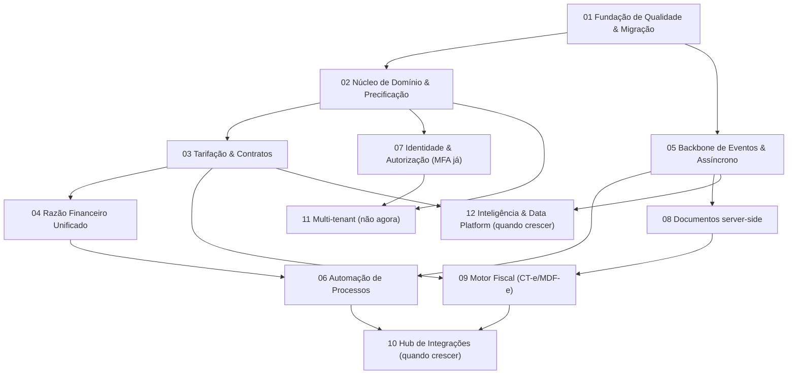

# 🗂️ Plano Estratégico de Execução — Velox TMS

> Transformação do `RELATORIO-CONSULTORIA.md` em plano executável, sob as lentes
> **Arquiteto Sênior + PO + Tech Lead** (skills: `vibe-code-auditor`, `ux-flow`).
> Projetos **1-indexados** e independentes; cada um é concluído (dev → teste →
> auditoria → done) antes do próximo iniciar. Gerado em 2026-07-01.

---

## 1. Consolidação, timing e eliminações

| Recomendação (consultoria) | Timing | Projeto |
|---|---|---|
| Lógica no servidor / thin client (A2) + serviço único de precificação (F7) | **Imediatamente** | 02 |
| Aposentar fachada `base44` (A1) | Próxima versão | 02 |
| Anon order → lead/cotação/qualificado (F1) | Próxima versão | 02 |
| Tarifa/contrato como entidade governada (A6/M1) | Próxima versão | 03 |
| Razão financeiro único / unificar baixa (D2/F8) + Freight Audit (M3) | Próxima versão | 04 |
| Backbone de eventos (A3) + async/jobs/realtime (A4) | Próxima versão | 05 |
| Automação faturamento/acerto/conciliação/status (F2–F5) + workflow exceções (M6) | Próxima versão / quando crescer | 06 |
| Autorização única (A5) + MFA | Próxima versão / MFA imediatamente | 07 |
| SSO SAML | Quando crescer (custo) | 07 |
| Serviço de documentos server-side (A7) | Próxima versão | 08 |
| Motor fiscal CT-e/MDF-e/CIOT (M2) | Próxima versão (provedor) | 09 |
| Notificações multicanal (M7) | Próxima versão (provedor) | 06/08 |
| Hub de integrações ERP/EDI/telemetria/bancos (M8) + status por telemetria (F4) | Quando crescer | 10 |
| Multi-tenant (M10) | **Não agora** (decisão) | 11 |
| ETA preditivo / prescritiva / pricing dinâmico + data platform (M11) | Quando crescer | 12 |

### ❌ Eliminadas neste estágio
Pátio/Doca (M4), Sinistros/Reversa (M5), Marketplace/rede, Multi-tenant (M10),
Pricing dinâmico/ML (M11), App motorista offline/navegação (M12), Gestão de
capacidade (M13) — reabrir por demanda/quando crescer.

### 🔗 Dependências de existência
- Automações (06) só existem com eventos (05) + razão unificado (04).
- Motor fiscal (09) exige documentos (08) + tarifa (03).
- Inteligência (12) exige eventos (05) + data platform + volume.
- Freight Audit automático (04) exige tarifa como entidade (03).

---

## 2. Projetos independentes

### **Projeto 01 — Fundação de Qualidade & Migração**
- **Objetivo:** rede de segurança para rearquitetar sem regressão.
- **Problema:** testes de fluxos/regras críticas insuficientes; migrations manuais (drift/erros só descobertos ao aplicar).
- **Benefícios:** refatoração segura, deploys previsíveis, base de observabilidade.
- **Pré-requisitos:** nenhum.
- **Dependências:** nenhuma.
- **Riscos:** baixo (aditivo); atenção ao ambiente de CI para migrations (Supabase/auth).
- **Avaliação:** Complexidade **Média** · Negócio **Baixo** (habilitador) · Arquitetural **Médio** · Timing **Imediatamente**.
- **Critérios de conclusão:** utils críticos puros cobertos; **CI aplica todas as migrations em banco limpo + reteste de idempotência**; captura global de erros do front.
- **✅ STATUS: CONCLUÍDO** (2026-07-01):
  - *Workstream A* — +32 testes cobrindo `coverageChecker`, `availabilityChecker`, `routePlanner`, `nfeUtils`, `nfeXml` (suíte 151→**183**).
  - *Workstream B* — job `migrations` no CI: Postgres limpo + `ci/db-stubs.sql` (roles/auth/storage) + `schema.sql` + todas as migrations em ordem + reaplicação (idempotência). Auto-auditoria já corrigiu 1 lacuna de stub (`storage.buckets.public`) e confirmou idempotência (todo ADD CONSTRAINT/CREATE POLICY tem DROP antes; seeds com WHERE NOT EXISTS/ON CONFLICT). *Validação executa no GitHub Actions (Docker local indisponível no ambiente).* 
  - *Workstream C* — captura global de erros já existia (`main.jsx`, "Onda E") e agora persiste em `client_errors` via `reportError`.
  - *Desvio informado:* preferência por Supabase CLI reavaliada — as migrations não são auto-contidas (baseline em `schema.sql`) e o stack do CLI auto-aplica migrations no start, o que não encaixa sem reestruturar o baseline (impacto em produção, fora do escopo P01). O gate Postgres+stubs valida o **mesmo** objetivo, sem reestruturar. Adotar o projeto Supabase CLI (migrations auto-contidas) fica como tarefa separada.
  - *Validação:* lint limpo · 183 testes · build OK · 5 E2E — nenhuma funcionalidade existente quebrada.

### **Projeto 02 — Núcleo de Domínio & Precificação Única**
- **Objetivo:** thin client; regras no servidor; 1 serviço de precificação; iniciar reestruturação de domínios (Order/Shipment vs Operação; Master Data vs Frota); pedido público vira cotação/lead.
- **Problema:** lógica no cliente (bypassável/duplicada) + fachada `base44`.
- **Benefícios:** consistência entre canais, segurança, testabilidade.
- **Pré-requisitos:** Projeto 01.
- **Dependências:** 01.
- **Riscos:** **Alto** (regressão de frete/pedido) — mitigado pelos testes de 01; migração incremental atrás de repositórios.
- **Avaliação:** Complexidade **Alta** · Negócio **Médio** · Arquitetural **Alto** · Timing **Imediatamente → próxima versão**.
- **Critérios de conclusão:** frete servido por 1 serviço para todos os canais; `base44` isolado atrás de repositórios; pedido público não faz mais INSERT anônimo.
- **📌 DECOMPOSIÇÃO (o P02 é grande demais para um portão só — dividido em sub-projetos gated):**
  - **P02.1 — Serviço único de precificação (cliente)** — ✅ **CONCLUÍDO** (2026-07-01, `158eb05`). `src/services/pricing.js` (`quoteFreight`) consumido por 8 telas + auditoria; `resolveClientPricing` migrado para o serviço; **zero uso direto de `calculateFreightFull` nas telas**; comportamento preservado; +5 testes (suíte 188); lint/build/E2E verdes.
  - **P02.2 — Precificação autoritativa no servidor** — ✅ **CONCLUÍDO** (2026-07-01, `78167d8`). Refinamento da decisão: **não** portamos a fórmula para SQL (evita duas fontes de verdade). Em vez disso, `create_public_order` (RPC `SECURITY DEFINER`, migr. `20260661`) passou a ser o **único** caminho do `/agendar`: gera protocolo/status no servidor, grava a **estimativa** do cliente (`freight_estimate`) e deixa `freight_value` **NULL** (autoritativo); RLS de INSERT anônimo removida; cobrança segue autoritativa em `confirm_order`. ⚠️ *Requer teste do fluxo anônimo `/agendar` em produção após aplicar a migration.*
  - **P02.3 — Aposentar `base44`** (fachada de entidades) — ✅ **CONCLUÍDO** (2026-07-01, lotes `a4f92d6` + `0a78794`). Nova camada `src/repositories/index.js` (`db`); as **276 chamadas** `base44.entities.*` migradas em lotes (não-admin → admin → utils) para `db.*`; Proxy `base44.entities` **removida**. `base44` mantém só `auth/storage/functions/integrations` (facetas menores, ~8 usos — retire opcional futuro). Comportamento idêntico; 188 testes/lint/build/E2E verdes.
  - **P02.4 — Pedido público → lead/cotação** — ✅ **CONCLUÍDO** (2026-07-01, `ce13aa1`). O essencial saiu no P02.2 (INSERT anônimo removido + frete = estimativa); o pipeline de triagem já existia (aba "Aprovação" + precificação/confirmação pela equipe). Acabamento: badge **"Site"** (com estimativa no tooltip) na fila de pedidos, distinguindo leads do site. *(CRM de leads completo — estágios/won-lost — não é necessário agora; seria scope creep.)*
  - **P02.5 — Reestruturação de domínios** — ✅ **RESOLVIDO** (2026-07-01, `ce13aa1`). Mapa de domínios explícito em `src/repositories` (`domains`) + `ARQUITETURA-FUNCIONAL.md`. A **reorganização física de pastas** (mover 66 arquivos + reescrever imports) foi **deliberadamente adiada**: churn de alto risco sem valor funcional — o seam de dados (`db`) já expõe as fronteiras.

  **➡️ PROJETO 02: 100% concluído** (P02.1–P02.5).

### **Projeto 03 — Tarifação & Contratos Governados**
- **Objetivo:** tarifa/contrato como entidade versionada e auditável.
- **Problema:** preços em JSON solto, sem versionamento/auditoria.
- **Benefícios:** precisão comercial, base de auditoria e tendering, upsell.
- **Pré-requisitos:** Projeto 02.
- **Dependências:** 02.
- **Riscos:** Médio (migração dos preços).
- **Avaliação:** Complexidade **Alta** · Negócio **Alto** · Arquitetural **Alto** · Timing **Próxima versão**.
- **Critérios de conclusão:** todo preço resolvido a partir de contrato versionado; histórico/auditoria; JSON legado migrado.

### **Projeto 04 — Razão Financeiro Unificado & Auditoria**
- **Objetivo:** razão de liquidação único; unificar `pay_invoice`/`reconcile`; separar subdomínios (AR/Payables/Auditoria/Tesouraria); Freight Audit & Pay completo.
- **Problema:** dois caminhos de baixa; conciliação manual; financeiro amalgamado.
- **Benefícios:** integridade financeira, auditabilidade.
- **Pré-requisitos:** Projeto 02 (03 recomendado).
- **Dependências:** 02, 03.
- **Riscos:** Médio/Alto (dados financeiros).
- **Avaliação:** Complexidade **Alta** · Negócio **Alto** · Arquitetural **Médio** · Timing **Próxima versão**.
- **Critérios de conclusão:** baixa única; auditoria contratado×executado×cobrado; relatórios batem com o razão.

### **Projeto 05 — Backbone de Eventos & Assíncrono**
- **Objetivo:** outbox/event bus + filas/jobs/agendador + realtime (substituir polling).
- **Problema:** acoplamento por tabelas; síncrono; polling não escala.
- **Benefícios:** desacoplamento, escala, habilitador de automação.
- **Pré-requisitos:** Projeto 01.
- **Dependências:** 01.
- **Riscos:** Médio (nova infra).
- **Avaliação:** Complexidade **Alta** · Negócio **Baixo** (habilitador) · Arquitetural **Alto** · Timing **Próxima versão**.
- **Critérios de conclusão:** eventos publicados nas transições-chave; ≥1 consumidor assíncrono em produção; rastreio/listas fora do polling.

### **Projeto 06 — Automação de Processos**
- **Objetivo:** faturamento por corte, acerto na entrega, conciliação auto de alta confiança, workflow de exceções, notificações multicanal.
- **Problema:** passos manuais que não escalam.
- **Benefícios:** produtividade, menos erro, SLA.
- **Pré-requisitos:** Projetos 04 e 05; notificação exige provedor de e-mail (custo).
- **Dependências:** 04, 05.
- **Riscos:** Médio.
- **Avaliação:** Complexidade **Alta** · Negócio **Alto** · Arquitetural **Médio** · Timing **Próxima versão / quando crescer**.
- **Critérios de conclusão:** fatura/acerto por evento/regra; conciliação auto; motor de notificação com ≥1 canal externo.

### **Projeto 07 — Identidade & Autorização**
- **Objetivo:** autorização única (policy-as-code); MFA (TOTP) com recuperação; SSO (adiado).
- **Problema:** autorização incoerente; sem MFA/SSO.
- **Benefícios:** segurança, compliance, enterprise-ready.
- **Pré-requisitos:** fluxo de recuperação de MFA (reset por admin).
- **Dependências:** sinergia com 02.
- **Riscos:** **Alto** (lockout MFA) — mitigado pela recuperação.
- **Avaliação:** Complexidade **Média** · Negócio **Médio** · Arquitetural **Médio** · Timing **MFA imediatamente; SSO quando crescer**.
- **Critérios de conclusão:** política central testada; MFA opt-in com reset auditado; SoD 100% no servidor.

### **Projeto 08 — Serviço de Documentos server-side**
- **Objetivo:** PDF/fiscais no servidor (romaneio, fatura, DACTE, etiquetas), em lote.
- **Problema:** documentos no cliente (jsPDF) não escalam nem servem fiscal.
- **Benefícios:** escala; base do fiscal.
- **Pré-requisitos:** Projeto 05 (jobs) recomendável.
- **Dependências:** habilita 09.
- **Riscos:** Médio.
- **Avaliação:** Complexidade **Média** · Negócio **Médio** · Arquitetural **Médio** · Timing **Próxima versão**.
- **Critérios de conclusão:** documentos gerados/armazenados no servidor; lote assíncrono.

### **Projeto 09 — Motor Fiscal Eletrônico (CT-e/MDF-e/CIOT)**
- **Objetivo:** emissão/integração com SEFAZ via provedor.
- **Problema:** sem documento fiscal não há operação legal como transportador.
- **Benefícios:** viabiliza operação legal; diferencial BR.
- **Pré-requisitos:** provedor fiscal (custo); Projetos 03 e 08.
- **Dependências:** 03, 08.
- **Riscos:** Alto (regulatório/integração).
- **Avaliação:** Complexidade **Alta** · Negócio **Alto** · Arquitetural **Alto** · Timing **Próxima versão (após decisão de provedor)**.
- **Critérios de conclusão:** CT-e/MDF-e autorizados em homologação e produção; contingência; guarda de XML/DACTE.

### **Projeto 10 — Hub de Integrações** — *quando crescer*
- **Objetivo:** conectores ERP/EDI, telemetria, bancos (CNAB/boleto/PIX).
- **Pré-requisitos:** Projeto 05; contratos/credenciais (custo). **Dependências:** 05, 06.
- **Avaliação:** Complexidade **Alta** · Negócio **Alto** · Arquitetural **Alto** · Timing **Quando crescer**.
- **Critérios de conclusão:** ≥1 ERP + ≥1 telemetria + baixa bancária por retorno em produção.

### **Projeto 11 — Multi-tenant (SaaS)** — *não agora (decisão)*
- **Objetivo:** isolamento por empresa. **Pré-requisitos:** 02, 07; RLS por tenant + onboarding. **Timing:** Não agora.

### **Projeto 12 — Inteligência & Data Platform** — *quando crescer*
- **Objetivo:** data platform + ETA preditivo, torre prescritiva, pricing dinâmico.
- **Pré-requisitos:** 03, 05, volume de dados. **Timing:** Quando crescer.

---

## 3. Sequência lógica (com portões dev → teste → auditoria → done)

**Ordem:** 01 → 02 → (03, 05 em paralelo controlado) → 04 → 06 → 07(MFA) → 08 → 09 → [10, 11, 12 quando/se].
**Regra de portão:** um projeto só é "done" com critérios de conclusão verdes **e** auditoria (arquitetura + testes + segurança). Só então o próximo inicia.
