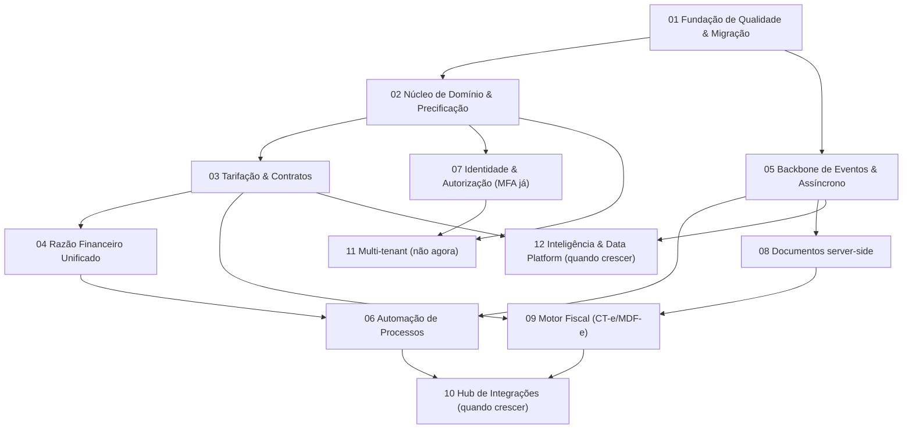

# 🗂️ Plano Estratégico de Execução — Velox TMS

> Transformação do `docs/historico/RELATORIO-CONSULTORIA.md` em plano executável, sob as lentes
> **Arquiteto Sênior + PO + Tech Lead** (skills: `vibe-code-auditor`, `ux-flow`).
> Projetos **1-indexados** e independentes; cada um é concluído (dev → teste →
> auditoria → done) antes do próximo iniciar. Gerado em 2026-07-01.

---

## 1. Consolidação, timing e eliminações

| Recomendação (consultoria) | Timing | Projeto |
|---|---|---|
| Lógica no servidor / thin client (A2) + serviço único de precificação (F7) | **Imediatamente** | 02 |
| Aposentar fachada `base44` (A1) | Próxima versão | 02 |
| Anon order → lead/cotação/qualificado (F1) | Próxima versão | 02 |
| Tarifa/contrato como entidade governada (A6/M1) | Próxima versão | 03 |
| Razão financeiro único / unificar baixa (D2/F8) + Freight Audit (M3) | Próxima versão | 04 |
| Backbone de eventos (A3) + async/jobs/realtime (A4) | Próxima versão | 05 |
| Automação faturamento/acerto/conciliação/status (F2–F5) + workflow exceções (M6) | Próxima versão / quando crescer | 06 |
| Autorização única (A5) + MFA | Próxima versão / MFA imediatamente | 07 |
| SSO SAML | Quando crescer (custo) | 07 |
| Serviço de documentos server-side (A7) | Próxima versão | 08 |
| Motor fiscal CT-e/MDF-e/CIOT (M2) | Próxima versão (provedor) | 09 |
| Notificações multicanal (M7) | Próxima versão (provedor) | 06/08 |
| Hub de integrações ERP/EDI/telemetria/bancos (M8) + status por telemetria (F4) | Quando crescer | 10 |
| Multi-tenant (M10) | **Não agora** (decisão) | 11 |
| ETA preditivo / prescritiva / pricing dinâmico + data platform (M11) | Quando crescer | 12 |

### ❌ Eliminadas neste estágio
Pátio/Doca (M4), Sinistros/Reversa (M5), Marketplace/rede, Multi-tenant (M10),
Pricing dinâmico/ML (M11), App motorista offline/navegação (M12), Gestão de
capacidade (M13) — reabrir por demanda/quando crescer.

### 🔗 Dependências de existência
- Automações (06) só existem com eventos (05) + razão unificado (04).
- Motor fiscal (09) exige documentos (08) + tarifa (03).
- Inteligência (12) exige eventos (05) + data platform + volume.
- Freight Audit automático (04) exige tarifa como entidade (03).

---

## 2. Projetos independentes

### **Projeto 01 — Fundação de Qualidade & Migração**
- **Objetivo:** rede de segurança para rearquitetar sem regressão.
- **Problema:** testes de fluxos/regras críticas insuficientes; migrations manuais (drift/erros só descobertos ao aplicar).
- **Benefícios:** refatoração segura, deploys previsíveis, base de observabilidade.
- **Pré-requisitos:** nenhum.
- **Dependências:** nenhuma.
- **Riscos:** baixo (aditivo); atenção ao ambiente de CI para migrations (Supabase/auth).
- **Avaliação:** Complexidade **Média** · Negócio **Baixo** (habilitador) · Arquitetural **Médio** · Timing **Imediatamente**.
- **Critérios de conclusão:** utils críticos puros cobertos; **CI aplica todas as migrations em banco limpo + reteste de idempotência**; captura global de erros do front.
- **✅ STATUS: CONCLUÍDO** (2026-07-01):
  - *Workstream A* — +32 testes cobrindo `coverageChecker`, `availabilityChecker`, `routePlanner`, `nfeUtils`, `nfeXml` (suíte 151→**183**).
  - *Workstream B* — job `migrations` no CI: Postgres limpo + `ci/db-stubs.sql` (roles/auth/storage) + `schema.sql` + todas as migrations em ordem + reaplicação (idempotência). Auto-auditoria já corrigiu 1 lacuna de stub (`storage.buckets.public`) e confirmou idempotência (todo ADD CONSTRAINT/CREATE POLICY tem DROP antes; seeds com WHERE NOT EXISTS/ON CONFLICT). *Validação executa no GitHub Actions (Docker local indisponível no ambiente).* 
  - *Workstream C* — captura global de erros já existia (`main.jsx`, "Onda E") e agora persiste em `client_errors` via `reportError`.
  - *Desvio informado:* preferência por Supabase CLI reavaliada — as migrations não são auto-contidas (baseline em `schema.sql`) e o stack do CLI auto-aplica migrations no start, o que não encaixa sem reestruturar o baseline (impacto em produção, fora do escopo P01). O gate Postgres+stubs valida o **mesmo** objetivo, sem reestruturar. Adotar o projeto Supabase CLI (migrations auto-contidas) fica como tarefa separada.
  - *Validação:* lint limpo · 183 testes · build OK · 5 E2E — nenhuma funcionalidade existente quebrada.

### **Projeto 02 — Núcleo de Domínio & Precificação Única**
- **Objetivo:** thin client; regras no servidor; 1 serviço de precificação; iniciar reestruturação de domínios (Order/Shipment vs Operação; Master Data vs Frota); pedido público vira cotação/lead.
- **Problema:** lógica no cliente (bypassável/duplicada) + fachada `base44`.
- **Benefícios:** consistência entre canais, segurança, testabilidade.
- **Pré-requisitos:** Projeto 01.
- **Dependências:** 01.
- **Riscos:** **Alto** (regressão de frete/pedido) — mitigado pelos testes de 01; migração incremental atrás de repositórios.
- **Avaliação:** Complexidade **Alta** · Negócio **Médio** · Arquitetural **Alto** · Timing **Imediatamente → próxima versão**.
- **Critérios de conclusão:** frete servido por 1 serviço para todos os canais; `base44` isolado atrás de repositórios; pedido público não faz mais INSERT anônimo.
- **📌 DECOMPOSIÇÃO (o P02 é grande demais para um portão só — dividido em sub-projetos gated):**
  - **P02.1 — Serviço único de precificação (cliente)** — ✅ **CONCLUÍDO** (2026-07-01, `158eb05`). `src/services/pricing.js` (`quoteFreight`) consumido por 8 telas + auditoria; `resolveClientPricing` migrado para o serviço; **zero uso direto de `calculateFreightFull` nas telas**; comportamento preservado; +5 testes (suíte 188); lint/build/E2E verdes.
  - **P02.2 — Precificação autoritativa no servidor** — ✅ **CONCLUÍDO** (2026-07-01, `78167d8`). Refinamento da decisão: **não** portamos a fórmula para SQL (evita duas fontes de verdade). Em vez disso, `create_public_order` (RPC `SECURITY DEFINER`, migr. `20260661`) passou a ser o **único** caminho do `/agendar`: gera protocolo/status no servidor, grava a **estimativa** do cliente (`freight_estimate`) e deixa `freight_value` **NULL** (autoritativo); RLS de INSERT anônimo removida; cobrança segue autoritativa em `confirm_order`. ⚠️ *Requer teste do fluxo anônimo `/agendar` em produção após aplicar a migration.*
  - **P02.3 — Aposentar `base44`** (fachada de entidades) — ✅ **CONCLUÍDO** (2026-07-01, lotes `a4f92d6` + `0a78794`). Nova camada `src/repositories/index.js` (`db`); as **276 chamadas** `base44.entities.*` migradas em lotes (não-admin → admin → utils) para `db.*`; Proxy `base44.entities` **removida**. `base44` mantém só `auth/storage/functions/integrations` (facetas menores, ~8 usos — retire opcional futuro). Comportamento idêntico; 188 testes/lint/build/E2E verdes.
  - **P02.4 — Pedido público → lead/cotação** — ✅ **CONCLUÍDO** (2026-07-01, `ce13aa1`). O essencial saiu no P02.2 (INSERT anônimo removido + frete = estimativa); o pipeline de triagem já existia (aba "Aprovação" + precificação/confirmação pela equipe). Acabamento: badge **"Site"** (com estimativa no tooltip) na fila de pedidos, distinguindo leads do site. *(CRM de leads completo — estágios/won-lost — não é necessário agora; seria scope creep.)*
  - **P02.5 — Reestruturação de domínios** — ✅ **RESOLVIDO** (2026-07-01, `ce13aa1`). Mapa de domínios explícito em `src/repositories` (`domains`) + `docs/arquitetura/ARQUITETURA-FUNCIONAL.md`. A **reorganização física de pastas** (mover 66 arquivos + reescrever imports) foi **deliberadamente adiada**: churn de alto risco sem valor funcional — o seam de dados (`db`) já expõe as fronteiras.

  **➡️ PROJETO 02: 100% concluído** (P02.1–P02.5).

### **Projeto 03 — Tarifação & Contratos Governados**
- **Objetivo:** tarifa/contrato como entidade versionada e auditável.
- **Problema:** preços em JSON solto, sem versionamento/auditoria.
- **Benefícios:** precisão comercial, base de auditoria e tendering, upsell.
- **Pré-requisitos:** Projeto 02.
- **Dependências:** 02.
- **Riscos:** Médio (migração dos preços).
- **Avaliação:** Complexidade **Alta** · Negócio **Alto** · Arquitetural **Alto** · Timing **Próxima versão**.
- **Critérios de conclusão:** todo preço resolvido a partir de contrato versionado; histórico/auditoria; JSON legado migrado.
- ✅ **CONCLUÍDO (2026-07-02)** — abordagem aditiva/incremental (motor de frete intocado; fallback read-through ao JSON legado). Sub-projetos:
  - **P03.1 — Snapshot imutável do frete** (`orders.freight_breakdown`; `buildFreightSnapshot`): ao precificar/confirmar, o cálculo é congelado (total + componentes + fonte da tabela + data efetiva). Migration `20260662`. Motor passou a expor `pricingSource` ("client"|"route:UF-UF"|"default").
  - **P03.2 — Tarifa versionada** (`tariff_tables` + `tariff_versions`): payload imutável, `version_no`, vigência, status (draft/active/archived), autor. RPCs `resolve_tariff_payload` (staff-guarded) e `tariff_publish_version` (arquiva a anterior + `log_action`). Resolvedor puro no cliente (`src/services/tariff.js`). Migration `20260663`.
  - **P03.3 — Migração do legado + wiring + auditoria de mudança**: seed idempotente `pricing`/`route_pricing[]`/`custom_pricing` → versões (`20260664`); overlay em `useCompanySettings` (default+route) e resolução por-data da tarifa do cliente em `quoteFreight`, ambos com **fallback**; saves em AdminSettings/ClientDetail publicam **nova versão** (não sobrescrevem). Todas as telas de cotação passaram a resolver via versão.
  - **P03.4 — UI de governança**: `TariffHistoryCard` (versões: nº/vigência/status/autor/nota) em AdminSettings (tabela padrão) e ClientDetail (contrato do cliente); selo 🔒 "Frete congelado" no pedido.
  - **Critérios atendidos:** ① preço resolvido de contrato versionado (com fallback durante transição) · ② histórico/auditoria (`tariff_versions` + `audit_log`/`log_action` + UI) · ③ JSON legado migrado (seed idempotente; JSON mantido como fallback).
  - **Validação:** 208 testes · lint · build · E2E (5) verdes. ⚠️ Aplicar migrations `20260662`→`20260664` no Supabase; após, testar cotação e edição de tarifa (não validável em runtime local).

### **Projeto 04 — Razão Financeiro Unificado & Auditoria**
- **Objetivo:** razão de liquidação único; unificar `pay_invoice`/`reconcile`; separar subdomínios (AR/Payables/Auditoria/Tesouraria); Freight Audit & Pay completo.
- **Problema:** dois caminhos de baixa; conciliação manual; financeiro amalgamado.
- **Benefícios:** integridade financeira, auditabilidade.
- **Pré-requisitos:** Projeto 02 (03 recomendado).
- **Dependências:** 02, 03.
- **Riscos:** Médio/Alto (dados financeiros).
- **Avaliação:** Complexidade **Alta** · Negócio **Alto** · Arquitetural **Médio** · Timing **Próxima versão**.
- **Critérios de conclusão:** baixa única; auditoria contratado×executado×cobrado; relatórios batem com o razão.
- ✅ **CONCLUÍDO (2026-07-02)** — abordagem aditiva (colunas de status preservadas como cache; razão como fonte de verdade dos eventos + alvo de reconciliação). Sub-projetos:
  - **P04.1 — Razão único + baixa única** (`settlements`, grão receita/despesa; RPCs `settle`/`unsettle`): `pay_invoice`, `reconcile_bank_tx` (todos os ramos) e os botões manuais de Receitas/Despesas passam a delegar a **uma** cascata (`settlement_apply`/`settlement_apply_invoice`). Corrige a duplicação da cascata de fatura e a **assimetria de estorno** (`unreconcile` agora reverte razão + status). Migration `20260665`.
  - **P04.2 — Auditoria contratado × executado × cobrado** (`src/services/freightThreeWay.js`): contratado = snapshot do P03; executado = recálculo pelo motor; cobrado = receita/fatura. `FreightAudit` elevado a 3-way.
  - **P04.3 — Backfill + reconciliação + subdomínios**: seed idempotente do razão a partir de received/paid (`20260666`); view `v_ledger_reconciliation` (relatório × razão) + verificações em `verificacoes.sql`; mapa `financeSubdomains` (AR/Payables/Treasury/Audit).
  - **P04.4 — UI**: aba **Razão** (ledger de eventos + estornos + indicador "bate/não bate") no Financeiro; `FreightAudit` 3-way.
  - **Segurança (autoauditoria):** funções internas revogadas de PUBLIC (evita bypass de SoD); baixa restrita a status liquidáveis (não baixa cancelada).
  - **Critérios atendidos:** ① baixa única (razão + `settle`) · ② 3-way (contratado×executado×cobrado) · ③ relatórios reconciliam via `v_ledger_reconciliation`/verificações.
  - **Validação:** 213 testes · lint · build · E2E (5) verdes. ⚠️ Aplicar migrations `20260665`→`20260666` no Supabase; após, testar baixa/estorno/conciliação e conferir a aba Razão.

### **Projeto 05 — Backbone de Eventos & Assíncrono**
- **Objetivo:** outbox/event bus + filas/jobs/agendador + realtime (substituir polling).
- **Problema:** acoplamento por tabelas; síncrono; polling não escala.
- **Benefícios:** desacoplamento, escala, habilitador de automação.
- **Pré-requisitos:** Projeto 01.
- **Dependências:** 01.
- **Riscos:** Médio (nova infra).
- **Avaliação:** Complexidade **Alta** · Negócio **Baixo** (habilitador) · Arquitetural **Alto** · Timing **Próxima versão**.
- **Critérios de conclusão:** eventos publicados nas transições-chave; ≥1 consumidor assíncrono em produção; rastreio/listas fora do polling.
- ✅ **CONCLUÍDO (2026-07-02)** — abordagem aditiva (emissão por triggers, sem tocar nas RPCs; realtime com fallback de polling longo). Sub-projetos:
  - **P05.1 — Outbox / event bus** (`domain_events` append-only + `emit_event`): emissão por **triggers** nas transições-chave — `order.created`/`order.status_changed`, `settlement.created`/`reversed`, `incident.opened`/`resolved`, `transfer.status_changed`. Um evento é só um INSERT (zero mudança de comportamento; captura RPC e update direto). Migration `20260667`.
  - **P05.2 — Realtime substitui polling** (`useRealtime` + publication `supabase_realtime`): ControlTower, OperationsHub e MapPage assinam `postgres_changes` e invalidam o cache; `refetchInterval` vira fallback longo (120s). Portal segue em polling **por design** (cliente lê via RPC, sem SELECT direto em `orders` → RLS não entrega realtime). Migration `20260668` (idempotente/tolerante).
  - **P05.3 — Jobs/agendador + consumidor assíncrono**: `sweep_overdue()` (marca receitas vencidas, idempotente, emite evento) despachada por `run_due_jobs()`; agendamento **pg_cron tolerante** (no-op se a extensão faltar) + RPC manual `run_due_jobs`; `job_runs` registra execuções. Migration `20260669`.
  - **P05.4 — Observabilidade**: `EventStreamCard` na Torre de Controle (fluxo de eventos ao vivo + último job + botão "Rodar jobs agora").
  - **Segurança (autoauditoria):** funções internas (`domain_event_write`, `sweep_overdue`) revogadas de PUBLIC; `run_due_jobs` aceita cron (sem auth) ou staff.
  - **Critérios atendidos:** ① eventos nas transições-chave (triggers) · ② consumidor assíncrono (`sweep_overdue` via pg_cron/`run_due_jobs`) · ③ rastreio/listas via realtime (polling só fallback).
  - **Validação:** 213 testes · lint · build · E2E (5) verdes. ⚠️ Aplicar `20260667`→`20260669`; habilitar **pg_cron** no painel Supabase (senão usar "Rodar jobs agora"); conferir realtime nas telas ao vivo.

### **Projeto 06 — Automação de Processos**
- **Objetivo:** faturamento por corte, acerto na entrega, conciliação auto de alta confiança, workflow de exceções, notificações multicanal.
- **Problema:** passos manuais que não escalam.
- **Benefícios:** produtividade, menos erro, SLA.
- **Pré-requisitos:** Projetos 04 e 05; notificação exige provedor de e-mail (custo).
- **Dependências:** 04, 05.
- **Riscos:** Médio.
- **Avaliação:** Complexidade **Alta** · Negócio **Alto** · Arquitetural **Médio** · Timing **Próxima versão / quando crescer**.
- **Critérios de conclusão:** fatura/acerto por evento/regra; conciliação auto; motor de notificação com ≥1 canal externo.
- ✅ **CONCLUÍDO (2026-07-02)** — automações sobre o backbone do P05 (jobs em `run_due_jobs` + eventos) e o razão do P04; tudo aditivo/idempotente, com os fluxos manuais preservados. Sub-projetos:
  - **P06.1 — Faturamento por corte** (`run_billing_cycle`): no `billing_day` do cliente `monthly`, gera fatura dos pedidos entregues não faturados (dia clampado ao fim do mês). `create_invoice` (manual) e o job passam por um montador único `invoice_build` (emite `invoice.created`). Migration `20260670`.
  - **P06.2 — Acerto na entrega** (`sweep_carrier_settlements`): lança o acerto do parceiro dos pedidos entregues com oferta aceita (idempotente por `carrier_expense_id`; `settle_carrier_order` manual e o job usam `carrier_settle_internal`). Emite `carrier.settled`.
  - **P06.3 — Conciliação automática** (`auto_reconcile`): aplica só matches de **alta confiança** (valor exato + ≤5 dias + candidato único); resto segue manual. `reconcile_bank_tx` (manual, com SoD) e o job usam `reconcile_internal`.
  - **P06.4 — Workflow de exceções** (`sweep_incident_sla`): SLA vira regra de **servidor** — emite `incident.sla_breached` (idempotente por evento) quando estoura.
  - **P06.5 — Motor de notificações** (`notifications` + `notify_from_events` + `dispatch_notifications`): eventos→regras→fila→despacho multicanal. Canal **in-app** ativo (grava alerta que o sino lê); canal **externo (e-mail)** é adaptador pronto → sem provedor, o dispatch marca `skipped`. Migration `20260671`.
  - **Correção (autoauditoria):** removido o CHECK restritivo de `alerts.type` (o app já inseria tipos fora da lista e falhava em silêncio); funções internas revogadas de PUBLIC.
  - **Critérios atendidos:** ① fatura/acerto por regra ✅ · ② conciliação auto ✅ · ③ motor de notificação **com in-app + adaptador externo pronto** — canal externo (e-mail) **pendente de provedor** (adiado por decisão de produto), portanto o critério fica **parcial e documentado**.
  - **Validação:** 213 testes · lint · build · E2E (5) verdes. ⚠️ Aplicar `20260670`→`20260671`; rodar via "Rodar jobs agora" (ou pg_cron) para acionar as automações.

### **Projeto 07 — Identidade & Autorização**
- **Objetivo:** autorização única (policy-as-code); MFA (TOTP) com recuperação; SSO (adiado).
- **Problema:** autorização incoerente; sem MFA/SSO.
- **Benefícios:** segurança, compliance, enterprise-ready.
- **Pré-requisitos:** fluxo de recuperação de MFA (reset por admin).
- **Dependências:** sinergia com 02.
- **Riscos:** **Alto** (lockout MFA) — mitigado pela recuperação.
- **Avaliação:** Complexidade **Média** · Negócio **Médio** · Arquitetural **Médio** · Timing **MFA imediatamente; SSO quando crescer**.
- **Critérios de conclusão:** política central testada; MFA opt-in com reset auditado; SoD 100% no servidor.
- ✅ **CONCLUÍDO (2026-07-02)** — autorização unificada + MFA opt-in com recuperação; SSO corporativo adiado. Sub-projetos:
  - **P07.1 — Política central (policy-as-code) + SoD 100%**: `has_capability(key)` é a **porteira única** (papel-base mínimo **E** deny-overlay via `my_permission`). **Fechou um furo:** `pay_invoice` checava só `my_permission` (default TRUE p/ todos) → agora exige `has_capability`. Enforço das 5 capacidades: `pay_invoice`, `reconcile`, `offer_carrier`, **`cancel_order`** (novo) e **`approve_access`** (novo, em `admin_approve_client/carrier` + `log_action`). `can()` do front alinhado; teste `permissions.test.js`. Migration `20260672`.
  - **P07.2 — MFA (TOTP) opt-in**: página **Segurança** (`/admin/seguranca`, atalho na topbar p/ todo staff) com enroll (QR+segredo), verificação e remoção do próprio fator; **desafio AAL2 no login** (pede o código quando há fator).
  - **P07.3 — Recuperação por admin (auditada)**: `admin_reset_mfa(user)` **SECURITY DEFINER** apaga `auth.mfa_factors` (sem service_role) + `log_action`; botão "2FA" em Usuários. Migration `20260673`.
  - **P07.4 — SSO**: **adiado** (Google OAuth já cobre login social; SSO/SAML corporativo fica para "quando crescer").
  - **Critérios atendidos:** ① política central testada (`has_capability` + `can` com testes) · ② MFA opt-in com reset auditado · ③ SoD 100% no servidor (5/5 capacidades).
  - **Validação:** 219 testes · lint · build · E2E (5) verdes. ⚠️ Aplicar `20260672`→`20260673`; **habilitar MFA/TOTP no painel Supabase (Auth)** para o enroll funcionar; testar login com 2FA e o reset por admin.

### **Projeto 08 — Serviço de Documentos server-side**
- **Objetivo:** PDF/fiscais no servidor (romaneio, fatura, DACTE, etiquetas), em lote.
- **Problema:** documentos no cliente (jsPDF) não escalam nem servem fiscal.
- **Benefícios:** escala; base do fiscal.
- **Pré-requisitos:** Projeto 05 (jobs) recomendável.
- **Dependências:** habilita 09.
- **Riscos:** Médio.
- **Avaliação:** Complexidade **Média** · Negócio **Médio** · Arquitetural **Médio** · Timing **Próxima versão**.
- **Critérios de conclusão:** documentos gerados/armazenados no servidor; lote assíncrono.
- ✅ **CONCLUÍDO (2026-07-02)** — serviço de documentos server-side (Edge Function) sobre o backbone do P05. Sub-projetos:
  - **P08.1 — Registro + Storage + fila**: tabela `documents` (fila: type/entity/status/storage_path/batch) + bucket **privado** `documents` + RLS staff + RPCs `request_document`/`request_documents_batch` (emitem `document.requested`) + realtime. Migration `20260674`.
  - **P08.2 — Modelo isomórfico** (`src/services/documentModel.js`): fonte **única** do conteúdo dos 6 documentos (fatura, comprovante, doc. transporte, romaneio de viagem, manifesto de transferência, etiquetas), pura e **testada** (`documentModel.test.js`, 7 casos). Reusável no servidor e no cliente.
  - **P08.3 — Geração no servidor** (`supabase/functions/render-documents`, Deno + pdf-lib): consome a fila, renderiza o PDF **no servidor** a partir do modelo, arquiva no bucket e marca `ready`. Processa em **lote** (`limit`). *Não validável localmente (sem Deno/deploy) — o modelo é testado em JS; a função é wrapper fino.*
  - **P08.4 — Frontend**: aba **Documentos (fila)** (`/admin/documentos-gerados`) com status ao vivo (realtime), botão "Processar fila no servidor" (invoca a Edge Function) e download por **signed URL**; botão "Arquivar" nas Faturas. Os geradores client jsPDF (download imediato) **preservados**.
  - **Decisão de escopo (autoauditoria):** os 6 geradores client ficaram **intactos** (zero regressão visual, não validável por mim); o modelo isomórfico é a fonte de conteúdo do servidor. **DACTE = layout base**, não emissão fiscal (SEFAZ = P09). Deploy da função com `verify_jwt` on (só autenticado invoca).
  - **Critérios atendidos:** ① documentos **gerados e armazenados no servidor** (Edge Function + bucket privado) · ② **lote assíncrono** (fila processada pela função, acionável por app/pg_cron).
  - **Validação:** 226 testes · lint · build · E2E (5) verdes. ⚠️ Aplicar `20260674`; **deploy** `supabase functions deploy render-documents`; testar "Arquivar" → "Processar fila" → download.

### **Projeto 09 — Motor Fiscal Eletrônico (CT-e/MDF-e/CIOT)**
- **Objetivo:** emissão/integração com SEFAZ via provedor.
- **Problema:** sem documento fiscal não há operação legal como transportador.
- **Benefícios:** viabiliza operação legal; diferencial BR.
- **Pré-requisitos:** provedor fiscal (custo); Projetos 03 e 08.
- **Dependências:** 03, 08.
- **Riscos:** Alto (regulatório/integração).
- **Avaliação:** Complexidade **Alta** · Negócio **Alto** · Arquitetural **Alto** · Timing **Próxima versão (após decisão de provedor)**.
- **Critérios de conclusão:** CT-e/MDF-e autorizados em homologação e produção; contingência; guarda de XML/DACTE.
- 🟡 **ARQUITETURA CONCLUÍDA (2026-07-02) — emissão real PENDENTE de provedor+certificado** (decisão de produto, conforme aprovado). Sub-projetos:
  - **P09.1 — Modelo + config fiscal**: tabela `fiscal_documents` (CT-e/MDF-e: status draft/provider_pending/pending/authorized/rejected/**contingency**/cancelled, chave, protocolo, xml_path/dacte_path, ambiente, provider, tentativas) + campos fiscais em `company_settings` (IE, CRT, RNTRC, série, ambiente, ref. certificado) + RLS + realtime. Migration `20260675`.
  - **P09.2 — Payload builder** (`src/services/fiscalPayload.js`): pedido + **tarifa versionada (P03)** + empresa → modelo CT-e/MDF-e provider-agnóstico, puro e **testado** (`fiscalPayload.test.js`, 6 casos).
  - **P09.3 — Adaptador + estados + contingência**: RPCs `fiscal_request`/`fiscal_mark_contingency`/`fiscal_cancel` (máquina de estados, emitem eventos `fiscal.*`); serviço cliente `fiscal.js`; **Edge Function esqueleto** `fiscal-emit` com adaptador de provedor **stub** (`provider_pending` enquanto não houver provedor — ponto de integração documentado). Guarda de XML/DACTE via o serviço do P08.
  - **P09.4 — Painel fiscal** (`FiscalPanel` no OrderWorkspace): emitir/contingência/cancelar CT-e, status ao vivo (realtime), com **rótulo explícito** "SEM PROVEDOR — não autoriza na SEFAZ". `orders.cte_number` manual preservado.
  - **Escopo/decisões (autoauditoria):** nada é emitido de verdade sem provedor (fica `draft`/`provider_pending`); rótulos evitam falsa conformidade; **CIOT** e a **UI de config fiscal em Configurações** ficam para o "ligar o provedor" (campos já existem no banco). RPCs guardadas por `is_staff`.
  - **Critérios:** ① CT-e/MDF-e autorizados em homolog/prod → **PENDENTE** (trava em provedor pago + certificado digital — decisão de produto) · ② contingência → **atendido** (estado + RPC) · ③ guarda de XML/DACTE → **atendido** (via P08, gravado na autorização).
  - **Validação:** 232 testes · lint · build · E2E (5) verdes. ⚠️ Aplicar `20260675`. Para LIGAR o fiscal: escolher provedor + certificado, preencher `company_settings.fiscal_provider`/config, implementar `emitViaProvider` na Edge Function e fazer deploy.

### **Projeto 10 — Hub de Integrações** — *quando crescer*
- **Objetivo:** conectores ERP/EDI, telemetria, bancos (CNAB/boleto/PIX).
- **Pré-requisitos:** Projeto 05; contratos/credenciais (custo). **Dependências:** 05, 06.
- **Avaliação:** Complexidade **Alta** · Negócio **Alto** · Arquitetural **Alto** · Timing **Quando crescer**.
- **Critérios de conclusão:** ≥1 ERP + ≥1 telemetria + baixa bancária por retorno em produção.

### **Projeto 11 — Multi-tenant (SaaS)** — *não agora (decisão)*
- **Objetivo:** isolamento por empresa. **Pré-requisitos:** 02, 07; RLS por tenant + onboarding. **Timing:** Não agora.

### **Projeto 12 — Inteligência & Data Platform** — *quando crescer*
- **Objetivo:** data platform + ETA preditivo, torre prescritiva, pricing dinâmico.
- **Pré-requisitos:** 03, 05, volume de dados. **Timing:** Quando crescer.

---

## 3. Sequência lógica (com portões dev → teste → auditoria → done)

**Ordem:** 01 → 02 → (03, 05 em paralelo controlado) → 04 → 06 → 07(MFA) → 08 → 09 → [10, 11, 12 quando/se].
**Regra de portão:** um projeto só é "done" com critérios de conclusão verdes **e** auditoria (arquitetura + testes + segurança). Só então o próximo inicia.
