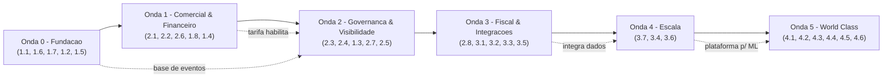

# 🚀 Roadmap Estratégico de Evolução — Velox TMS

> Plano de evolução por **níveis de maturidade**, derivado de
> `INVENTARIO-SISTEMA.md`, `ARQUITETURA-FUNCIONAL.md`, `MAPA-FLUXOS-PERFIS.md` e
> `GAP-ANALYSIS-ENTERPRISE.md`.
>
> Gerado em 2026-06-30 (skills: `redesign-existing-projects`, `ui-ux-designer`,
> `vibe-code-auditor`).
>
> **Legenda:** Prioridade (P) Alta/Média/Baixa · Impacto (I) Alto/Médio/Baixo ·
> Esforço (E) S(<1 sem) / M(1–4 sem) / L(1–3 meses) / XL(>3 meses).

O Velox está hoje **entre MVP e Profissional**: ciclo operacional fechado,
portais, financeiro básico, rastreio, subcontratação e conciliação.

---

## 🟢 Nível 1 — MVP (consolidar o mínimo viável robusto)

**1.1 Pipeline de migrações versionadas** — P: Alta · I: Alto · E: S · Dep: —
Justificativa: aplicação manual gera risco de drift código×banco.
Op: implantações previsíveis · Téc: sem divergência de schema · Usuário: menos falhas.

**1.2 Motor de notificações transacionais (e-mail base)** — P: Alta · I: Alto · E: M · Dep: provedor de e-mail
Justificativa: hoje só toasts/`alerts`, sem canal externo.
Op: menos suporte reativo · Téc: canal único · Usuário: avisos de status/fatura.

**1.3 ETA + milestones no rastreio** — P: Alta · I: Alto · E: M · Dep: 1.2 + rastreio
Justificativa: mostra posição, sem previsão/marcos.
Op: menos suporte · Téc: base de eventos · Usuário: visibilidade real.

**1.4 Fechar ciclo financeiro do parceiro** — P: Alta · I: Alto · E: M · Dep: subcontratação + financeiro
Justificativa: registra valor combinado, mas não paga o parceiro.
Op: acerto completo · Téc: parceiro no ledger · Usuário(parceiro): recebimento rastreável.

**1.5 Unificar design system dos portais** — P: Média · I: Médio · E: M · Dep: tokens do admin
Justificativa: admin tokenizado/dark; portais com paleta clara hardcoded.
Op: marca coesa · Téc: menos divergência CSS · Usuário: experiência consistente.

**1.6 Cobertura de testes dos fluxos críticos** — P: Alta · I: Médio · E: M · Dep: CI
Justificativa: testes só de utils + smoke.
Op: menos regressões · Téc: rede de segurança · Usuário: estabilidade.

**1.7 Paginação server-side nas listas de maior volume** — P: Média · I: Médio · E: M · Dep: —
Justificativa: `.list(500/1000)` + filtro no cliente.
Op: telas rápidas com massa · Téc: menos carga no browser · Usuário: responsividade.

**1.8 Conciliação ligada à fatura/boleto** — P: Média · I: Médio · E: M · Dep: conciliação
Justificativa: baixa concilia receita/despesa, não a fatura.
Op: baixa correta · Téc: unifica caminhos de baixa · Usuário: financeiro coerente.

---

## 🔵 Nível 2 — Profissional

**2.1 Motor de tarifação (rating engine)** — P: Alta · I: Alto · E: L · Dep: cadastros + financeiro
Contratos por lane/faixa/acessoriais/fuel. Op: preço correto · Téc: fonte única de tarifa · Usuário: cotação confiável.

**2.2 Freight audit & payment (3-way match)** — P: Alta · I: Alto · E: L · Dep: 2.1
Op: corta sobrepreço · Téc: ledger conciliado · Usuário: faturas corretas.

**2.3 RBAC granular + SoD + audit log central** — P: Alta · I: Alto · E: L · Dep: AuthContext/RLS
Op: compliance · Téc: permissão por função/campo/filial · Usuário: acesso adequado.

**2.4 Control Tower (exceções unificadas)** — P: Média · I: Alto · E: M · Dep: alerts/incidents/SLA
Op: ação proativa · Téc: agrega eventos · Usuário: operação no controle.

**2.5 Tendering automático + scorecard de parceiros** — P: Média · I: Alto · E: L · Dep: subcontratação + 2.1
Op: melhor custo/serviço · Téc: alocação por regra · Usuário(parceiro): ofertas justas.

**2.6 Boleto/CNAB/PIX + baixa por retorno** — P: Alta · I: Alto · E: L · Dep: financeiro + banco
Op: cobrança/baixa automatizadas · Téc: integração bancária · Usuário: pagamento fácil.

**2.7 BI/Analytics (freight spend, OTIF, custo por lane)** — P: Média · I: Alto · E: L · Dep: dados consolidados
Op: decisão por dado · Téc: camada analítica · Usuário(gestor): KPIs acionáveis.

**2.8 CT-e/MDF-e (emissão via provedor)** — P: Alta · I: Alto · E: L · Dep: provedor fiscal
Op: opera legalmente · Téc: integra SEFAZ · Usuário: documento fiscal válido.

---

## 🟣 Nível 3 — Enterprise

**3.1 Compliance fiscal completo (CT-e/MDF-e/CIOT/ANTT/seguro)** — P: Alta · I: Alto · E: XL · Dep: 2.8
**3.2 Integrações ERP/EDI (SAP/TOTVS/Oracle/X12)** — P: Alta · I: Alto · E: XL · Dep: contratos
**3.3 SSO/MFA (SAML/OIDC) + provisionamento** — P: Alta · I: Médio · E: L · Dep: IdP
**3.4 Multi-tenant real (SaaS)** — P: Alta · I: Alto · E: XL · Dep: rearquitetura RLS + onboarding
**3.5 Telemetria/rastreadores + status automático** — P: Média · I: Alto · E: L · Dep: APIs externas
**3.6 Otimizador de rota/carga (VRP, janelas, pedágio)** — P: Média · I: Alto · E: XL · Dep: mapas enterprise
**3.7 Arquitetura de eventos + filas/jobs + observabilidade** — P: Alta · I: Alto · E: XL · Dep: infra

---

## 🟡 Nível 4 — World Class

**4.1 ETA preditivo + exceções preditivas (ML)** — P: Média · I: Alto · E: XL · Dep: 3.7 + dados
**4.2 Pricing dinâmico (ML)** — P: Baixa · I: Alto · E: XL · Dep: 2.1 + dados
**4.3 Control tower prescritiva** — P: Média · I: Alto · E: XL · Dep: 2.4 + ML
**4.4 Otimização de rede em tempo real (continuous moves/pooling)** — P: Baixa · I: Alto · E: XL · Dep: 3.6
**4.5 ESG/pegada de carbono por embarque** — P: Baixa · I: Médio · E: L · Dep: dados de viagem
**4.6 Workflows autônomos (auto-tender, auto-resolução)** — P: Baixa · I: Alto · E: XL · Dep: 3.7 + ML

---

## 🔗 Sequência lógica de implementação (ondas)

### Dependências (resumo)
- **Onda 0** é pré-requisito de tudo (confiabilidade, testes, notificações, eventos).
- **Tarifação (2.1)** habilita auditoria (2.2), tendering (2.5) e pricing dinâmico (4.2).
- **Governança (2.3)** precede integrações corporativas e multi-tenant.
- **Eventos/observabilidade (3.7)** é a base para automação e ML (Onda 5).
- **CT-e/MDF-e (2.8→3.1)** é o portão fiscal para escalar legalmente.

---

## 📌 Status de execução (atualizado conforme implementação)
Pré-roadmap: rastreamento ao vivo, portal da transportadora, conciliação bancária, A2 (parcial), E2E no CI.

**Onda 0 — Fundação:**
- ✅ 1.4 Ciclo financeiro do parceiro (`83cacc5`)
- ✅ 1.5 Design unificado dos portais em tokens (`1e43552`)
- ✅ 1.6 Testes de utils críticos — routeOptimizer + revenueHelper (`a4c1da5`)
- ✅ 1.7 Paginação server-side — primitivo `.page()` + DriverHistory (`3c8c7c3`)
- ✅ 1.8 Conciliação ligada à fatura (`adbfa36`)
- ⚪ 1.1 Migrações versionadas: padrão idempotente já é regra; falta automação em CI
- 🟡 1.2 Notificações (e-mail): **bloqueado** — aguarda decisão do provedor
- 🟡 1.3 ETA + milestones: milestones viáveis; a notificação depende de 1.2

Migrations novas a aplicar: `20260655_carrier_settlement`, `20260656_reconcile_invoice`.

**Onda 1 — Comercial & Financeiro (concluída, exceto 2.6 adiado):**
- ✅ 2.1 Rating engine — faixas de peso + fuel surcharge (`aba9806`, `5ab3429`)
- ✅ 2.2 Freight audit (cobrado × tabela) (`8f84a1e`)
- ✅ 1.4 Ciclo do parceiro · ✅ 1.8 Conciliação por fatura
- 🟡 2.6 Boleto/CNAB/PIX: **adiado** — aguarda decisão de banco/gateway

**Onda 2 — Governança & Visibilidade (CONCLUÍDA):**
- ✅ 2.3 Audit log central (`f85709c`) + RBAC granular/SoD (`91701f5`)
- ✅ 2.4 Torre de Controle — exceções unificadas (`60ba2ee`)
- ✅ 2.5 Scorecard + tendering assistido (`a842a0b`, `d1b7ffe`) — falta só o broadcast/waterfall automático
- ✅ 2.7 BI/Analytics — OTIF + custo por lane/cliente (`d09bfdd`)
- ✅ 1.3 Marcos (milestones) no portal (`d1b7ffe`) — notificação por e-mail segue adiada

Migrations novas a aplicar: `20260657_audit_log`, `20260658_rbac_permissions`.

### 🎯 Progresso geral: Ondas 0, 1 e 2 entregues (exceto itens adiados por decisão).

**Onda 3/4 — itens COST-FREE já entregues:**
- ✅ 2.3 (completado) SoD server-side em reconcile/offer + UI-gates (`08f18bc`, migr. `20260659`)
- ✅ 3.6 (parcial) Otimizador de rota com refino 2-opt (`eef5f24`)
- ✅ 3.7 (base) Observabilidade — erros do front no banco (`fe7cecf`, migr. `20260660`)
- ✅ 4.5 ESG — pegada de carbono (`8ca060a`)

**Onda 3 — cost-free restante (com ressalva):**
- ⚠️ 3.3 (parte) MFA/2FA (TOTP Supabase, grátis) — **não implementado**: sem um
  caminho de recuperação (reset de fator por admin via service-role/edge
  function) há risco real de lockout. Requer decisão sobre recuperação.

**Onda 3/4 — dependem de custo/decisão (mapeados):** fiscal CT-e/MDF-e (provedor),
ERP/EDI, SSO SAML (plano pago), telemetria (API), multi-tenant (decisão),
notificações e-mail (provedor), boleto/CNAB (banco), ML/preditivo e pricing
dinâmico (plataforma de dados).

Migrations novas a aplicar: `20260659_sod_enforcement`, `20260660_client_errors`.

**Rearquitetura (ver `PLANO-EXECUCAO.md`):**
- ✅ **Projeto 01 — Fundação de Qualidade & Migração** concluído: +32 testes de
  utils críticos (suíte 183), **gate de migrations no CI** (schema.sql + todas as
  migrations + idempotência, via Postgres+stubs), captura global de erros. O gate
  teria pego o erro do `20260658` antes de aplicar.
- ✅ **Projeto 02.1 — Serviço único de precificação** concluído: `quoteFreight`
  em `src/services/pricing.js` consumido por 8 telas + auditoria (suíte 188,
  comportamento preservado). Sub-projetos P02.2 (servidor autoritativo, via
  plpgSQL) · P02.3 (retire base44) · P02.4 (público→lead) · P02.5 (domínios)
  ficam gated. Ver `PLANO-EXECUCAO.md`.
- ✅ **Projeto 02.2 — Frete autoritativo no servidor** concluído: `/agendar` via
  RPC `create_public_order` (frete do cliente vira estimativa; `freight_value`
  NULL até a equipe precificar); RLS de INSERT anônimo removida (`20260661`).
  Restam P02.3 (retire base44), P02.4 (público→lead completo), P02.5 (domínios).

Migration nova a aplicar: `20260661_public_order_authoritative` (⚠️ testar `/agendar` após).
- ✅ **Projeto 02.3 — Aposentar a fachada `base44` (entidades)** concluído: nova
  camada de repositórios `db` (`src/repositories`); 276 chamadas `base44.entities.*`
  migradas em lotes; Proxy removida. `base44` mantém só auth/storage/functions.
- ✅ **Projeto 02.4 — Público→lead** concluído: o essencial saiu no P02.2 (INSERT
  anônimo removido + frete = estimativa); triagem via aba "Aprovação" já existia.
  Acabamento: badge **"Site"** (estimativa no tooltip) na fila, distinguindo leads.
- ✅ **Projeto 02.5 — Domínios** resolvido: mapa `domains` explícito em
  `src/repositories`. Reorg **física** de pastas adiada (churn sem valor funcional).

**➡️ Projeto 02 (Núcleo de Domínio & Precificação Única): 100% concluído** — 188 testes / lint / build / E2E verdes.

**Adiados (mapeados):** 1.2/1.3-notificação (provedor de e-mail), 2.6 integração bancária (banco/gateway), 3.4 multi-tenant (decisão de produto).
