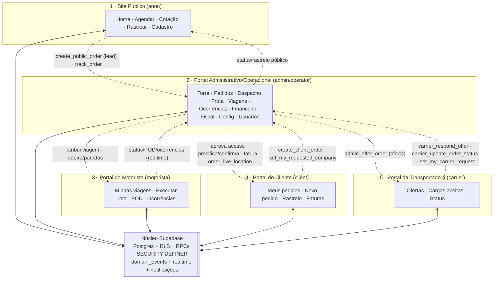

# Velox TMS — Documentação Oficial dos Portais (Canais de Acesso)

> Documento **descritivo** do estado atual (as-is). **Não** contém propostas de melhoria.
> "Portal" aqui = **canal de acesso** ao sistema (não domínio de negócio).
> Fonte: roteamento (`src/App.jsx`), guards (`src/components/auth/*`, `src/components/ProtectedRoute.jsx`),
> papéis (`src/lib/AuthContext.jsx`), política (`src/lib/permissions.js` + `has_capability`) e RPCs Supabase.

## Modelo de comunicação (importante)

Os portais **não se comunicam diretamente entre si (não há peer-to-peer)**. Toda a
comunicação é **mediada pelo núcleo Supabase** — tabelas Postgres + **RLS** + RPCs
`SECURITY DEFINER` + o **backbone de eventos/realtime** (`domain_events`, triggers,
`run_due_jobs`, publicação `supabase_realtime`) e o **motor de notificações** (in-app).
Um portal "produz" gravando em tabelas/RPCs; outro "consome" lendo (filtrado por RLS/
RPC do seu papel). O portal Administrativo é o **hub** que orquestra os demais.

## Portais identificados (5)

| # | Portal | Rota base | Papéis (role) | Autenticação |
|---|---|---|---|---|
| 1 | **Site Público / Institucional** | `/`, `/agendar`, `/cotacao`, `/rastrear` | — (anônimo) + auth | Nenhuma (anon) |
| 2 | **Portal Administrativo / Operacional** | `/admin/*` | `admin`, `operator` | Supabase Auth (+MFA opt-in) |
| 3 | **Portal do Motorista** | `/motorista/*` | `motorista` | Supabase Auth |
| 4 | **Portal do Cliente** | `/portal/*` | `client` | Supabase Auth (via aprovação) |
| 5 | **Portal da Transportadora (Parceiro)** | `/parceiro/*` | `carrier` | Supabase Auth (via aprovação) |

> Estado intermediário `pending`: usuário autenticado sem papel aprovado → redirecionado a `/sem-acesso` (não é um portal).

---

## Diagrama de comunicação entre os portais (Mermaid)

---
---

# 1 · Site Público / Institucional

- **Nome do portal:** Site Público / Institucional (canal anônimo).
- **Objetivo:** apresentar a empresa, captar leads/pedidos, oferecer cotação e permitir rastreamento sem login.
- **Público-alvo:** visitantes/prospects, embarcadores sem cadastro, destinatários rastreando carga.
- **Responsabilidades:** vitrine institucional; agendamento/solicitação de coleta (lead); cotação de frete (estimativa); rastreamento por protocolo/CT-e; ponto de entrada para login e cadastros (cliente/parceiro).
- **Funcionalidades disponíveis:**
  - `/` Home (institucional: hero, cobertura, contato).
  - `/agendar` (`BookingForm`) — solicitação de coleta anônima → `create_public_order`.
  - `/cotacao` (`QuoteForm`) e `/cotacao-avancada` (`QuickQuote`) — estimativa de frete (motor `quoteFreight`, sem gravar preço).
  - `/rastrear` (`Tracking`) — status do pedido por protocolo/CT-e (`track_order`).
  - Auth: `/login`, `/register`, `/portal/cadastro` (`ClientRegister`), `/parceiro/cadastro` (`CarrierRegister`), `/forgot-password`, `/reset-password`, `/sem-acesso`.
- **Módulos acessíveis:** institucional, agendamento, cotação, rastreamento, cadastro/login. Sem acesso a módulos internos.
- **Fluxos existentes:**
  1. **Lead/agendamento:** preenche coleta → `create_public_order` → cria pedido com `requester_name`, `freight_estimate`, `freight_value` NULL, status `new` ou `awaiting_approval` (conforme `require_order_approval`) → aparece na fila do Portal Administrativo (badge "Site").
  2. **Cotação:** informa carga/rota → estimativa via motor (não persiste).
  3. **Rastreamento:** informa protocolo/CT-e → `track_order` retorna status/marcos.
  4. **Cadastro:** cliente/parceiro se registra → vira `pending` até aprovação do Admin.
- **Permissões:** nenhuma (anônimo). Leitura restrita ao subconjunto público via RPC `public_settings`; escrita apenas via `create_public_order` (autoritativa no servidor — não grava `freight_value`). Sem RLS de tabela (INSERT anônimo direto removido no P02.2).
- **Perfis de usuários:** anônimo (sem sessão).
- **Como se comunica com os demais:** **Produz leads** para o Portal Administrativo (`create_public_order`); **consome** dados de status produzidos por Admin/Motorista (`track_order`). Não acessa outros portais diretamente.
- **Quais informações consome:** `public_settings` (hero, cobertura, textos, subset de precificação), status de rastreio.
- **Quais informações produz:** pedidos-lead (`orders` com `requester_name`/`freight_estimate`), mensagens de contato, solicitações de cadastro (`ContactMessage`, perfis `pending`).
- **Dependências:** motor de precificação (`quoteFreight`/tarifa P03), `company_settings` (via `public_settings`), protocolo (`next_protocol`).
- **Integrações:** Supabase (anon key), Google Maps (cobertura/mapa quando configurado). Sem integrações externas de pagamento/fiscal.

---

# 2 · Portal Administrativo / Operacional

- **Nome do portal:** Portal Administrativo / Operacional (núcleo do TMS, `/admin/*`).
- **Objetivo:** operar todo o TMS — comercial, operação, frota, financeiro, fiscal, governança e configuração.
- **Público-alvo:** equipe interna (administradores e operadores da transportadora).
- **Responsabilidades:** gestão de pedidos e cotação; despacho/roteirização e replanejamento; frota e viagens; ocorrências (SLA); cadastros; subcontratação (ofertas a parceiros); financeiro (razão de liquidação, faturas, conciliação, DRE/fluxo, auditoria de frete); tarifação versionada; documentos server-side; fiscal (arquitetura); notificações; usuários/permissões (SoD); auditoria; configuração.
- **Funcionalidades disponíveis (módulos):**
  - **Operação (admin+operator):** Torre de Controle, Pedidos/Coletas, Cotação, Despacho, Replanejamento, Ocorrências, Transferências, Frota, Viagens, Cadastros, Transportadoras, Documentos, **Documentos (fila)**, Mensagens, Alertas, **Segurança (2FA)**.
  - **Gestão (admin only):** Financeiro (Resumo, Faturas, Receitas, Despesas, DRE, Fluxo de Caixa, Conciliação, **Razão**, Auditoria de frete), Config, Usuários, Indicadores, Análises, **Acessos de Cliente**, **Acessos de Parceiro**, Auditoria.
- **Módulos acessíveis:** todos os módulos internos (dois níveis: operacional e gestão).
- **Fluxos existentes (principais):**
  - Pedido: triagem do lead → precificação (snapshot P03) → confirmação (cria receita) → despacho → viagem → entrega → faturamento (corte/manual) → baixa (razão P04).
  - Ocorrência: abertura → SLA (escala server-side) → resolução.
  - Subcontratação: `admin_offer_order` → resposta do parceiro → acerto na entrega (P06).
  - Financeiro: `settle`/`unsettle`, `pay_invoice`, conciliação (auto/manual), reconciliação relatório×razão.
  - Governança: aprovação de acessos, permissões (deny-overlay), MFA/reset, auditoria.
- **Permissões:** dois guards de rota — `OperatorRoute` (admin+operator) e `AdminRoute` (admin). **SoD granular** via `has_capability` (porteira única): `pay_invoice`, `reconcile`, `cancel_order`, `offer_carrier` (equipe) e `approve_access` (admin), com deny-overlay por usuário (`user_profiles.permissions`).
- **Perfis de usuários:** `admin` (acesso total, incl. gestão), `operator` (operacional; sem financeiro/config/usuários/aprovação de acesso).
- **Como se comunica com os demais:** é o **hub**. Recebe leads do Público; aprova acessos de Cliente/Parceiro; atribui viagens ao Motorista; oferta cargas ao Parceiro; precifica/fatura/rastreia para o Cliente; publica status que o Público rastreia. Toda comunicação mediada pelo núcleo (tabelas/RPCs/eventos/realtime).
- **Quais informações consome:** praticamente todas as entidades (orders, trips, revenues/expenses, invoices, settlements, tariffs, incidents, fiscal_documents, domain_events, notifications, users, company_settings…).
- **Quais informações produz:** pedidos precificados/confirmados, viagens, faturas, liquidações (razão), tarifas versionadas, ofertas a parceiros, aprovações de acesso, documentos (fila), documentos fiscais (draft/provider_pending), eventos e notificações.
- **Dependências:** núcleo Supabase (Auth/Postgres/Storage/RLS), motor de precificação (P02/P03), razão (P04), backbone de eventos/jobs (P05), automações (P06), política/MFA (P07), serviço de documentos (P08), motor fiscal (P09).
- **Integrações:** Supabase (auth/db/storage/realtime), Edge Functions (`render-documents`, `fiscal-emit`), Google Maps; **pendentes de decisão**: provedor de e-mail (notificações externas), banco/gateway, provedor fiscal.

---

# 3 · Portal do Motorista

- **Nome do portal:** Portal do Motorista (`/motorista/*`, mobile-first).
- **Objetivo:** executar viagens/coletas/entregas em campo e reportar o andamento.
- **Público-alvo:** motoristas da frota própria (papel `motorista`).
- **Responsabilidades:** ver viagens atribuídas; avançar status de coleta/entrega; anexar comprovante (POD); registrar ocorrências; consultar histórico.
- **Funcionalidades disponíveis:**
  - `/motorista` (`DriverHome`) — viagens atribuídas / próxima.
  - `/motorista/viagem/:id` (`DriverTrip`) — executar roteiro: iniciar viagem, avançar paradas, `collecting`/`in_transit`/`delivered`, upload de POD, registrar ocorrência.
  - `/motorista/historico` (`DriverHistory`) — viagens concluídas.
- **Módulos acessíveis:** apenas suas viagens/paradas/ocorrências e upload de documentos. Sem acesso a financeiro, cadastros ou configuração.
- **Fluxos existentes:**
  1. **Execução:** recebe viagem (atribuída pelo Admin) → inicia (`Trip.update` → `in_progress`) → por parada: coleta/entrega (`Order.update` status + POD via `uploadFile`) → conclui viagem.
  2. **Ocorrência:** registra `Incident.create`/`update` (avaria/atraso/etc.) → avisa a equipe (alerta).
- **Permissões:** `DriverRoute` (só `motorista`). Leitura via RLS `driver_read_orders` (apenas pedidos das suas viagens); escrita restrita a status/POD/ocorrências dos seus pedidos.
- **Perfis de usuários:** `motorista` (vinculado a `drivers` via `user_profiles.driver_id`).
- **Como se comunica com os demais:** **Produz** atualizações (status, POD, ocorrências, posição) que a Torre/Operação do Admin consome **em tempo real** (realtime) e que alimentam o rastreio do Cliente/Público (`order_live_location`, `track_order`). Recebe do Admin a **atribuição de viagens**.
- **Quais informações consome:** viagens/paradas/pedidos atribuídos a si; dados de entrega.
- **Quais informações produz:** transições de status de pedido/viagem, comprovantes (POD/Storage), ocorrências, eventos `order.status_changed`.
- **Dependências:** núcleo Supabase (RLS de motorista), Storage (POD), backbone de eventos/realtime (P05).
- **Integrações:** Supabase; geolocalização do dispositivo (posição/rastreio quando disponível). Sem integrações externas próprias.

---

# 4 · Portal do Cliente

- **Nome do portal:** Portal do Cliente (`/portal/*`).
- **Objetivo:** autoatendimento do embarcador — solicitar coletas, acompanhar pedidos e ver faturas.
- **Público-alvo:** clientes contratantes aprovados (papel `client`).
- **Responsabilidades:** criar pedidos; acompanhar status e rastreio ao vivo; consultar faturas.
- **Funcionalidades disponíveis:**
  - `/portal` (`ClientOrders`) — meus pedidos (`my_client_orders`).
  - `/portal/novo` (`ClientNewOrder`) — novo pedido (`create_client_order`; estimativa via motor).
  - `/portal/pedido/:id` (`ClientOrderDetail`) — detalhe + rastreio (`my_client_order` + `order_live_location`).
  - `/portal/faturas` (`ClientInvoices`) — faturas do cliente (`my_client_invoices`).
- **Módulos acessíveis:** somente os próprios pedidos/faturas/perfil (via RPCs `my_client_*`). **Sem SELECT direto em `orders`** — acesso exclusivamente por RPC `SECURITY DEFINER` (por isso o rastreio do portal usa polling, não realtime).
- **Fluxos existentes:**
  1. **Onboarding:** cadastro (`/portal/cadastro`) → `set_my_requested_company` (fica `pending`) → **Admin aprova** (`admin_approve_client`) → vira `client`.
  2. **Novo pedido:** cria via `create_client_order` → entra na fila do Admin (precificação/confirmação).
  3. **Acompanhamento:** vê status/rastreio (`order_live_location`) e faturas.
- **Permissões:** `ClientRoute` (só `client`). Acesso a dados exclusivamente por RPCs filtradas pelo `client_id` do próprio usuário (`user_profiles.client_id`).
- **Perfis de usuários:** `client` (vinculado a `clients` via `user_profiles.client_id`).
- **Como se comunica com os demais:** **Produz** pedidos e solicitações de acesso para o Admin; **consome** o que o Admin produz (preço/confirmação/fatura) e o rastreio alimentado pelo Motorista. Sem acesso a outros portais.
- **Quais informações consome:** seus pedidos/status, rastreio (`order_live_location`), suas faturas, seu perfil.
- **Quais informações produz:** pedidos (`create_client_order`), solicitação de vínculo de empresa (`set_my_requested_company`).
- **Dependências:** núcleo Supabase (RPCs `my_client_*`), aprovação prévia do Admin, motor de precificação (estimativa).
- **Integrações:** Supabase; Google Maps (rastreio). Sem pagamentos online (fatura é documento; baixa é interna).

---

# 5 · Portal da Transportadora (Parceiro)

- **Nome do portal:** Portal da Transportadora / Parceiro subcontratado (`/parceiro/*`).
- **Objetivo:** receber e responder ofertas de carga subcontratada e reportar o andamento das cargas aceitas.
- **Público-alvo:** transportadoras parceiras (papel `carrier`).
- **Responsabilidades:** ver ofertas; aceitar/recusar; acompanhar cargas aceitas; atualizar status.
- **Funcionalidades disponíveis:**
  - `/parceiro` (`CarrierOffers`) — ofertas recebidas (`my_carrier_offers`).
  - `/parceiro/cargas` (`CarrierOrders`) — cargas aceitas (`my_carrier_orders`).
  - `/parceiro/carga/:id` (`CarrierOrderDetail`) — detalhe + `carrier_update_order_status`.
- **Módulos acessíveis:** apenas ofertas/cargas atribuídas ao próprio parceiro (RPCs `my_carrier_*`). Sem acesso a financeiro/cadastros internos.
- **Fluxos existentes:**
  1. **Onboarding:** cadastro (`/parceiro/cadastro`) → `set_my_carrier_request` (`pending`) → **Admin aprova** (`admin_approve_carrier`) → vira `carrier`.
  2. **Oferta→aceite:** Admin oferta (`admin_offer_order`, capacidade `offer_carrier`) → parceiro responde (`carrier_respond_offer` = aceita/recusa → `carrier_status`).
  3. **Execução:** parceiro atualiza status (`carrier_update_order_status`); na entrega, o **acerto ao parceiro** é lançado (P06 `sweep_carrier_settlements` → despesa a pagar).
- **Permissões:** `CarrierRoute` (só `carrier`). Acesso por RPCs filtradas pelo `carrier_id` do usuário (`user_profiles.carrier_id`).
- **Perfis de usuários:** `carrier` (vinculado a `carriers` via `user_profiles.carrier_id`).
- **Como se comunica com os demais:** **Consome** ofertas produzidas pelo Admin; **produz** respostas de oferta e status que o Admin consome (e que geram a despesa de acerto no Financeiro). Sem acesso a outros portais.
- **Quais informações consome:** ofertas (`my_carrier_offers`), cargas aceitas (`my_carrier_orders`), seu perfil.
- **Quais informações produz:** aceite/recusa de oferta (`carrier_respond_offer`), status da carga (`carrier_update_order_status`), solicitação de acesso (`set_my_carrier_request`).
- **Dependências:** núcleo Supabase (RPCs `my_carrier_*`), aprovação prévia do Admin, subcontratação/acerto (P06).
- **Integrações:** Supabase. Sem integrações externas próprias.

---

## Matriz-resumo (produz → consome)

| Origem (produz) | Destino (consome) | Mecanismo (mediado pelo núcleo) |
|---|---|---|
| Público | Administrativo | `create_public_order` (lead), `ContactMessage` |
| Público | (leitura) | `track_order`, `public_settings` |
| Cliente | Administrativo | `create_client_order`, `set_my_requested_company` |
| Parceiro | Administrativo | `carrier_respond_offer`, `carrier_update_order_status`, `set_my_carrier_request` |
| Motorista | Administrativo | `Trip/Order.update`, `Incident.*`, POD, eventos/realtime |
| Administrativo | Cliente | aprovação, precificação/confirmação, fatura, `order_live_location` |
| Administrativo | Motorista | atribuição de viagem/roteiro |
| Administrativo | Parceiro | `admin_offer_order` |
| Administrativo/Motorista | Público/Cliente | status de rastreio |

> **Nota final:** nenhuma comunicação é portal→portal direta. Todo o tráfego passa pelo **núcleo Supabase** (Postgres + RLS + RPCs `SECURITY DEFINER` + `domain_events`/realtime + notificações). O Portal Administrativo é o orquestrador central.
